<div align="center">

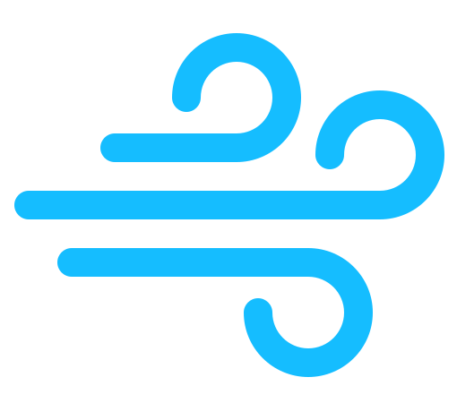

# Zephyrus

### The Hospital Operations Command Center

**Rigorous. Composed. Defensible.**

A single, real-time operations cockpit that unifies the Emergency Department, Real-Time
Demand & Capacity, Perioperative services, and Process Improvement into one instrument —
built to be *trusted at a glance* during a surge and *defended line-by-line* in a Monday review.

[](https://github.com/sudoshi/Zephyrus/actions/workflows/main.yml)
&nbsp;·&nbsp; Laravel 11 · React 18 + Inertia 2 · PostgreSQL · Laravel Reverb

</div>

---

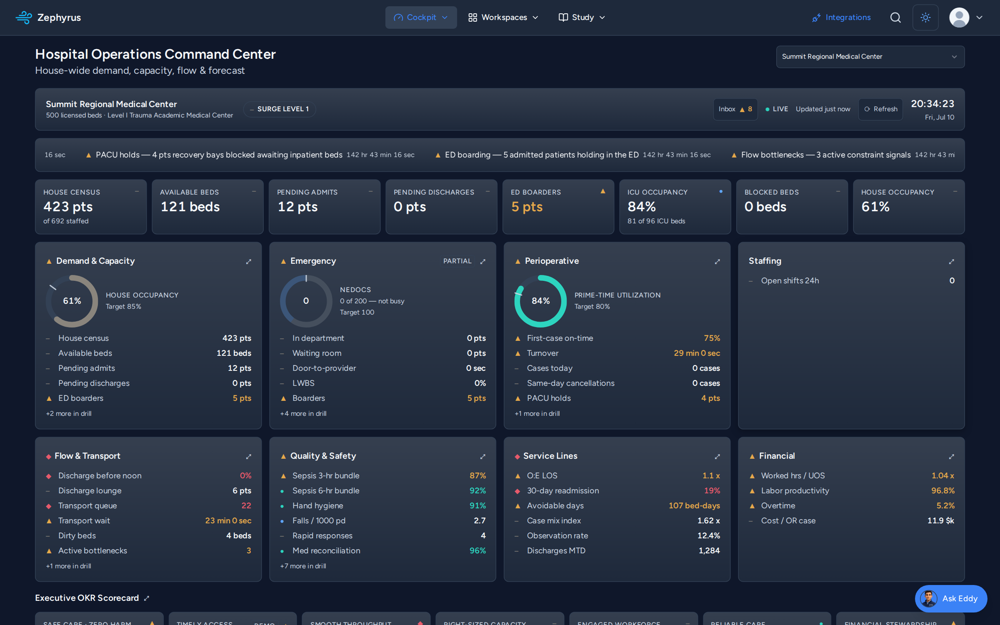

> The **Operations Cockpit** — an ISA-101 high-performance situational-awareness surface.
> Grey is the resting baseline; saturated status color is an *earned* exception signal;
> status is always encoded by **shape + color + label**, never color alone.

---

## What Zephyrus is

Zephyrus is a **product-register command center** for hospital operations. Its audience is
mixed and switched by role rather than split across separate products:

- **House-wide operations leaders** — nursing supervisors, bed managers, command-center staff
  managing demand vs. capacity and flow across the whole hospital.
- **Frontline unit staff** — charge nurses and ED clinicians working a single department live,
  mid-shift, glancing rather than studying.
- **Executives & administrators** — CMO / COO / CNO reviewing throughput, utilization, and
  outcomes with numbers that survive scrutiny.

Everything descends from one deterministic path: **glance → drill-in-place → live workspace →
retrospective study** — the *Altitude* model, surfaced in the top navigation as
**Cockpit → Workspaces → Study**.

## Zephyrus 2.0 — one instrument, not a binder of dashboards

Zephyrus 2.0 collapsed six parallel overview dashboards and eight navigation silos into a single
cohesive cockpit. The consolidation is live: legacy overview URLs now resolve as graceful
drill-in-place redirects into the cockpit (`/dashboard/emergency → /dashboard?drill=ed`,
`/dashboard/perioperative → ?drill=periop`, `improvement/overview → ?drill=quality`) rather than
404s. One home, one design language, one status engine, one snapshot contract, one navigation
source, and one closed action loop.

- **One server-computed snapshot** per facility drives the whole cockpit.
- **Mount-anywhere**: the same instrument mounts at house / service-line / department / unit scope
  (RBAC-scoped) and strips its chrome for **wall-display** mode.
- **Earned urgency**: status color is rationed (teal / amber / coral / sky); coral-red is reserved
  for real breaches. No alarm-fatigue dashboards.

---

## Screens

| Patient Flow 4D navigator | Arena — object-centric process intelligence |
|---|---|
| 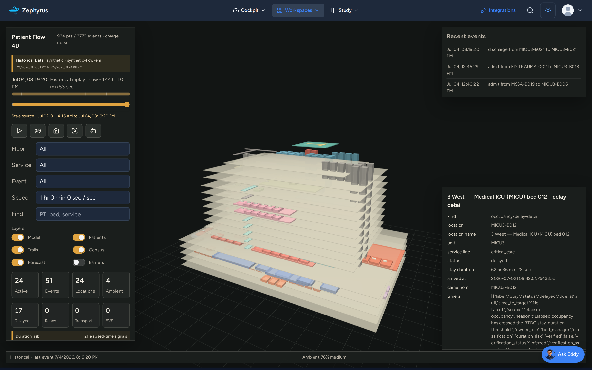 | 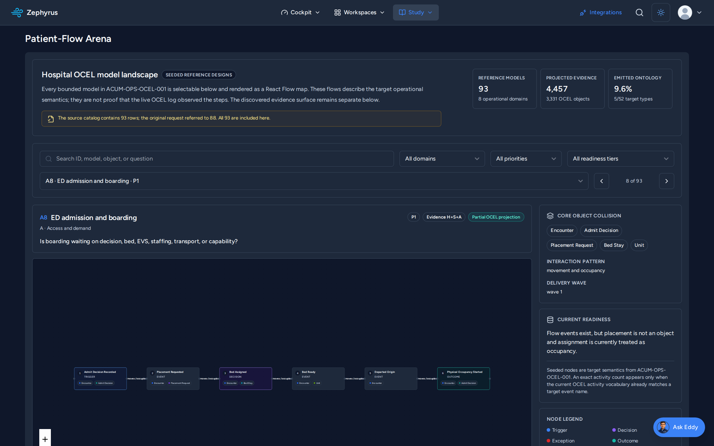 |

| Eddy — governed agent inbox | Administration & accountability ledger |
|---|---|
| 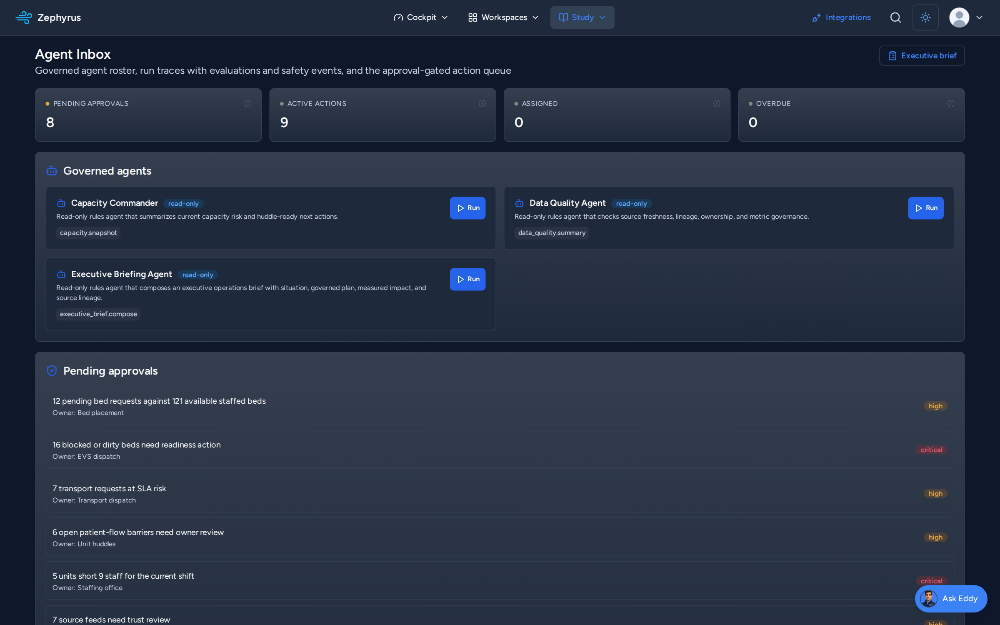 | 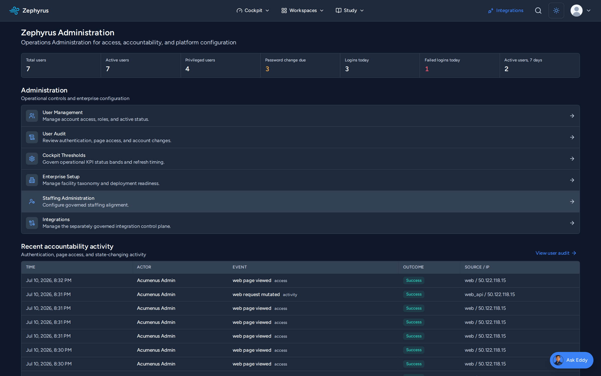 |

| RTDC bed tracking | Global demand/capacity huddle |
|---|---|
| 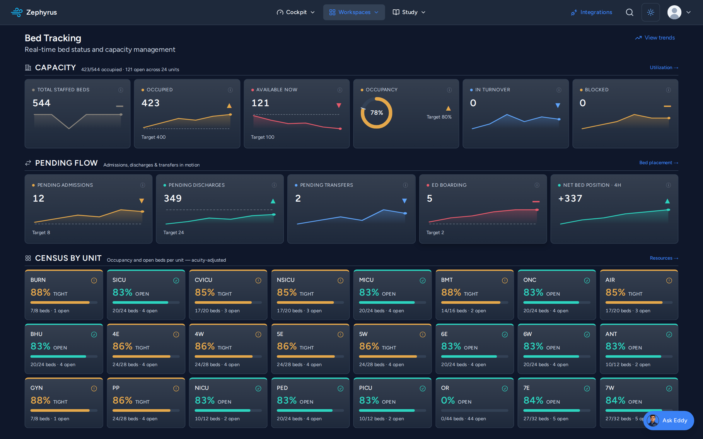 | 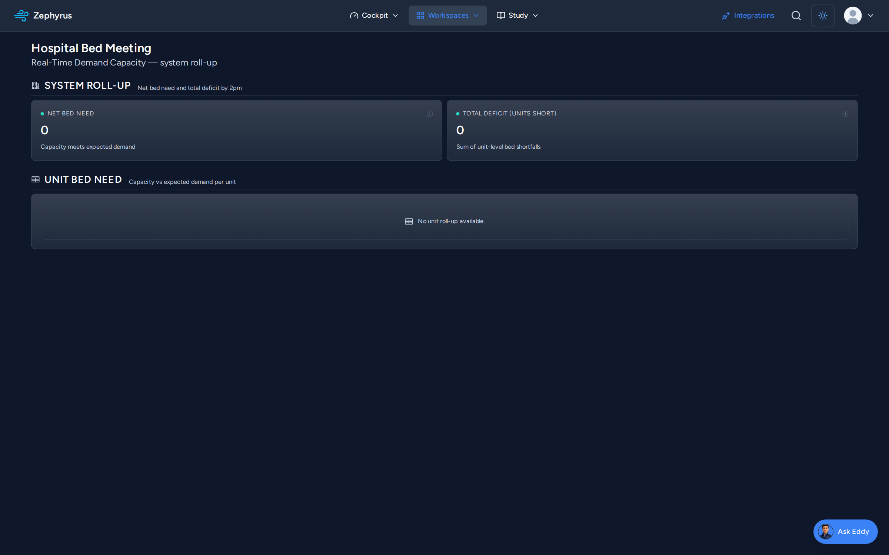 |

| Perioperative — OR utilization | Process intelligence |
|---|---|
| 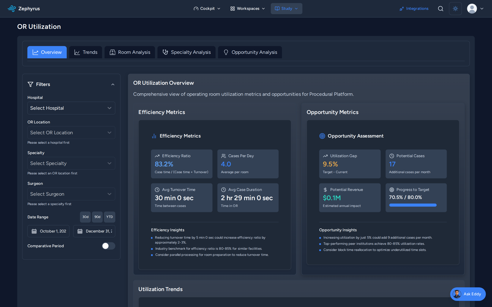 | 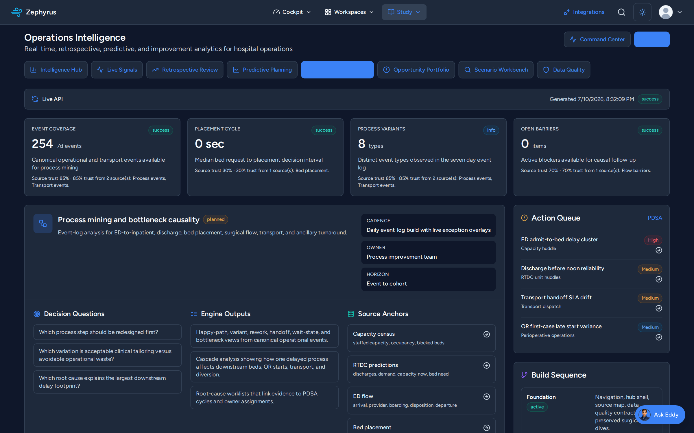 |

| Executive brief | Staffing |
|---|---|
| 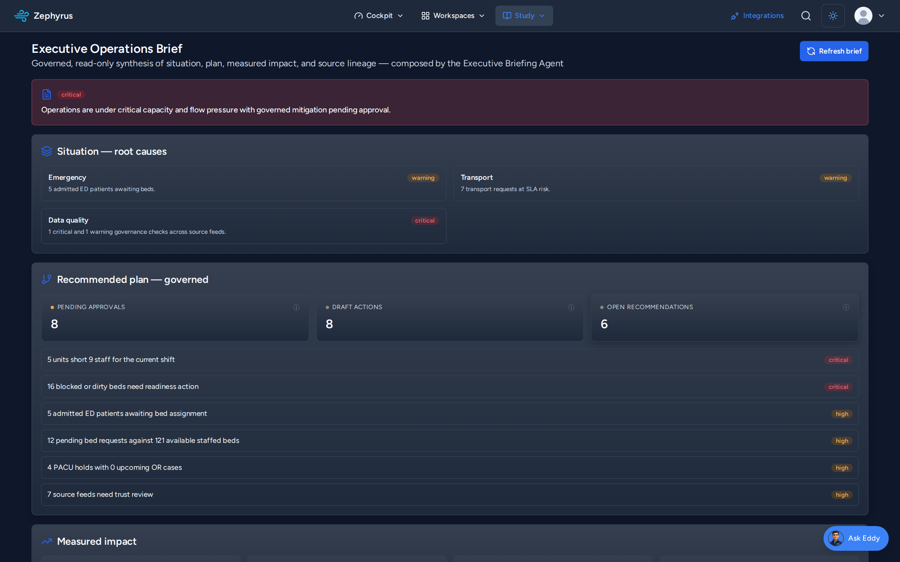 | 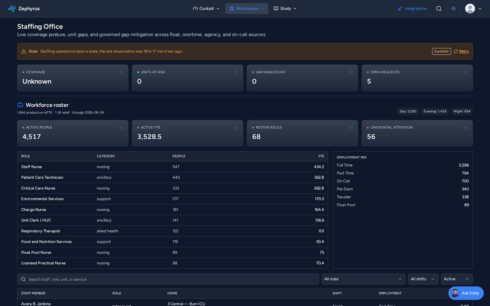 |

> All screens above render **synthetic demo data** (Summit Regional Medical Center, a fictional
> teaching hospital). No real patient information is shown.

---

## Core workflows

### 🚑 Emergency Department (ED)
Live ED operations — census, door-to-provider, LWBS, boarding, EMS inbound — with percentile-based
metrics computed directly from `prod.*` fact tables, plus a live **NEDOCS** crowding index.

### 🛏️ Real-Time Demand & Capacity (RTDC)
Event-sourced house-wide capacity: bed tracking, bed placement, the **Patient Flow 4D navigator**
(a WebGL time-replay of occupancy across floors/units), and global / service / unit **huddles**.

### 🔪 Perioperative
Block and OR utilization, prime-time utilization, room-running, turnover times, case scheduling, and
room status — with denominators that agree across the app.

### 📈 Process Improvement
PDSA cycles, root-cause analysis, bottleneck detection, an opportunity library, and process mining
over an object-centric event log.

### 👥 Staffing · 🚐 Transport · 🔌 Integrations
Canonical shift-fulfillment staffing, EMS/transport request & dispatch lifecycle, and an
operational integrations control plane for connectors and feed health.

---

## The intelligence layer

### Eddy — governed operations copilot
Eddy is an **approval-gated** operations agent. Every action flows through a human approval queue;
agents are read-only by default and declare role, scope, PHI policy, dry-run, rollback, and audit
metadata. The cockpit's warn/crit tiles feed the Eddy **Action Inbox** and **Executive Brief**,
closing the loop from *glance → alert → proposed action → human approval*. Model routing runs
against a local LLM (MedGemma / qwen3 via a LiteLLM proxy) so that operations copiloting does not
depend on the cloud.

### Arena — object-centric process intelligence
Arena projects operations into an **OCEL 2.0** (Object-Centric Event Log) and mines it with
**OCPM / pm4py** (Python sidecar). It renders the live *Hospital OCEL model landscape*, runs
conformance checking, and routes findings back into the cockpit and Eddy. An optional Arena copilot
(X4) answers questions against the model.

### Hummingbird — native mobile companion
A Kotlin-Multiplatform (Android/iOS) companion app backed by a mobile BFF, surfacing the cockpit,
Patient Flow, service-line views, and Eddy approvals on the go.

---

## Architecture

**Thin Laravel backend, React front-of-house over Inertia.** Controllers render pages with
`Inertia::render()`; there are no Blade views for the main app. JSON APIs under `/api/` serve AJAX
data and the mobile BFF.

| Layer | Technology |
|---|---|
| **Backend** | Laravel 11 · PHP 8.2+ · Sanctum · Spatie Permission · `firebase/php-jwt` (OIDC) |
| **Frontend** | React 18 · TypeScript · Inertia.js 2 · Vite 6 · TailwindCSS 3 · HeroUI |
| **Realtime** | Laravel Reverb (WebSockets) + Laravel Echo |
| **Charts / viz** | Nivo · Recharts · Chart.js · ReactFlow · three.js (Patient Flow 4D) |
| **Database** | PostgreSQL, multi-schema `raw → stg → prod → star` (+ `fhir`); app reads `prod` |
| **Process mining** | Python + pm4py sidecar (Arena), OCEL 2.0 projection |
| **AI** | Local MedGemma / qwen3 via LiteLLM proxy (Eddy + Arena copilots) |
| **Mobile** | Kotlin Multiplatform (Hummingbird), mobile BFF |

**Controller organization** is by domain (`Analytics/`, `Operations/`, `Predictions/`, `Rtdc/`,
`Ed/`, `Staffing/`, `Transport/`, `Ops/`, `Integrations/`, `Admin/`, `Api/*`). Navigation has a
single source of truth: `resources/js/config/navigationConfig.ts` drives the section menu, mobile
drawer, command palette, and active-route ownership.

> Deeper engineering conventions live in **[AGENTS.md](AGENTS.md)**; design context in
> **[PRODUCT.md](PRODUCT.md)** and **[DESIGN.md](DESIGN.md)**; the full evolution plan in
> **[docs/ZEPHYRUS-2.0-PLAN.md](docs/ZEPHYRUS-2.0-PLAN.md)**.

---

## Design system

A disciplined, enforced token canon (see [CLAUDE.md](CLAUDE.md)):

- **Two-System Rule** — a blue/slate `healthcare-*` palette governs all operational surfaces;
  crimson `#9B1B30` + gold `#C9A227` is the Acumenus brand/heritage + focus layer only.
- **Dark-default, dual-theme**; **Figtree** everywhere; metrics in `tabular-nums`; gold
  `:focus-visible`. Weights 400/500/600 only (no faux-bold), one `Surface` primitive, no raw
  Tailwind palette in app code.
- **Status never by color alone** — always paired with an arrow, icon, or label.
- Accessibility target: **WCAG 2.2 AA** (pragmatic).

The canon is machine-enforced: `scripts/check-ui-canon.sh` hard-fails on violations and an
`/impeccable` design hook flags regressions on every edit.

---

## Authentication & security

- **Managed onboarding** — registration collects name / email / phone only; the backend generates a
  temporary password and delivers it via Resend email. First login forces a password change
  (`must_change_password` + a non-dismissable modal). No self-chosen passwords.
- **Authentik OIDC SSO** for single sign-on (`firebase/php-jwt`).
- **RBAC** via Spatie permissions; API auth via Sanctum.
- **Administration console** (`/admin`) — user management, cockpit thresholds, enterprise setup,
  and an **append-only user audit ledger** recording actor, event, outcome, and source IP for
  authentication, page access, and state-changing activity.

See [AUTHENTICATION.md](AUTHENTICATION.md) and `.claude/rules/auth-system.md` for the protected
auth contract.

---

## Getting started

**Prerequisites:** PHP 8.2+, Composer, Node.js + npm, PostgreSQL 16/17.

```bash
git clone https://github.com/sudoshi/Zephyrus.git
cd Zephyrus

composer install
npm install

cp .env.example .env
php artisan key:generate

# Provision the schemas + synthetic demo hospital (Summit Regional)
php artisan migrate
php artisan zephyrus:demo-seed
```

### Run the dev servers

```bash
./start-dev.sh          # Laravel (:8001) + Vite HMR (:5176)
./stop-dev.sh

# or, concurrently (serve + queue + pail + vite):
composer run dev
```

### Build, test, lint

```bash
npm run build                 # production frontend
php artisan test              # PHP feature/unit tests
npm run test                  # Vitest (frontend)
npm run test:e2e              # Playwright E2E
./vendor/bin/pint             # PHP code style
npx tsc --noEmit              # TypeScript check
```

The isolated test lanes, concurrent full-suite proof, production-resource guard, and hashed release-evidence workflow are documented in [Testing and Release Evidence](docs/TESTING-AND-RELEASE-EVIDENCE.md).

---

## Deployment

Production is **manual-only**. GitHub Actions runs **CI only** (Pint, PHPUnit, TypeScript, Vite
build) and must never deploy.

```bash
./deploy.sh --check      # read-only local/GitHub/SSH/production preflight
./deploy.sh              # sync exact CI-successful main, build, deploy, and verify
./deploy.sh --frontend   # compatibility label; full app deploy, no migrations
./deploy.sh --migrate \
  --path database/migrations/YYYY_MM_DD_HHMMSS_example.php
                         # backed-up, path-scoped migration after app deployment
```

Production runs behind **Apache + php8.5-fpm** at `https://zephyrus.acumenus.net`, with Reverb as a
systemd WebSocket service. Do **not** deploy via GitHub Actions, ad-hoc SSH, or direct production
`git pull`. See [DEPLOYMENT_CHECKLIST.md](DEPLOYMENT_CHECKLIST.md) and the
[development/release runbook](docs/operations/DEVELOPMENT-AND-PRODUCTION-RELEASE-RUNBOOK.md).

---

## Project status

Zephyrus 2.0 (P0–P7 of the [evolution plan](docs/ZEPHYRUS-2.0-PLAN.md)) is **shipped and deployed to
production** across all operational domains, with the live cockpit, Eddy governance loop, and Arena
process intelligence enabled. The **mount-anywhere / wall-display** slice (P8) and native mobile
hardening are in active beta.

This is a **beta** with a maintained, stakeholder-facing limitation register:
**[docs/beta-known-limitations.md](docs/beta-known-limitations.md)**. In summary: all screens run
**synthetic demo data** (disclosed in-product); Eddy actions are approval-gated and largely
dry-run; connectors are proven against synthetic feeds, not certified production integrations; and
iOS native builds require a macOS host to validate.

---

## Documentation map

| Doc | What it covers |
|---|---|
| [PRODUCT.md](PRODUCT.md) | Strategic product context, audience, personality, design principles |
| [DESIGN.md](DESIGN.md) | The visual system — "The Operations Bridge" |
| [AGENTS.md](AGENTS.md) | Engineering / build / deploy conventions |
| [AUTHENTICATION.md](AUTHENTICATION.md) | Auth flow & protected contract |
| [docs/ZEPHYRUS-2.0-PLAN.md](docs/ZEPHYRUS-2.0-PLAN.md) | The full 2.0 evolution master plan |
| [docs/ZEPHYRUS-2.0-PART-X.md](docs/ZEPHYRUS-2.0-PART-X.md) | Arena — object-centric process intelligence |
| [docs/EDDY-AI-AGENT-PLAN.md](docs/EDDY-AI-AGENT-PLAN.md) | Eddy agent architecture & governance |
| [DEPLOYMENT_CHECKLIST.md](DEPLOYMENT_CHECKLIST.md) | Release runbook |

---

## License

MIT © Acumenus Data Sciences / Wellstack.ai
