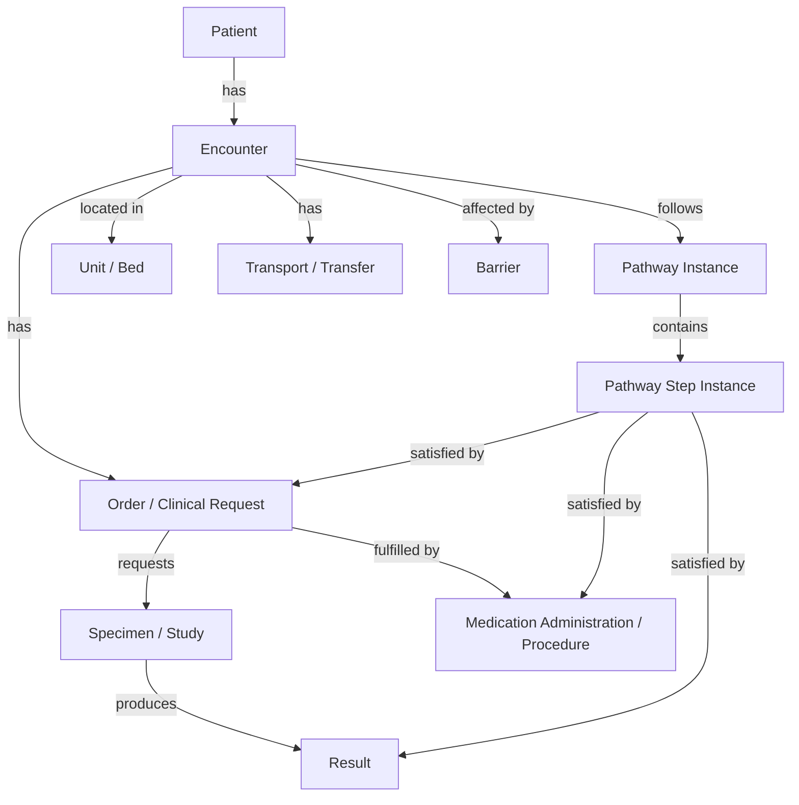

# Zephyrus OCEL Care-Pathway Measurement and Root-Cause Architecture

**Research and architecture report**  
**Date:** 2026-07-21  
**Last re-audited:** 2026-07-21  
**Scope:** Zephyrus OCEL 2.0 implementation, Arena analytics, and integration of `DRG_Care_Pathways_250_Verification_Package_v43_1.xlsx`  
**Current repository workbook SHA-256:** `6617bda522a55bfa3e6971b00bb3d1862d6f6567a1119f07f2682e468e5c293e`  
**Prior plan/import-manifest-reported SHA-256:** `42cadf84dce297c5a839784148ebd2c5375320350394c0d143411008ed5bd171`  
**Release identity:** unresolved byte-identity mismatch; do not promote or activate definitions until reconciled  
**Decision status:** Architecture recommendation; not an implementation, institutional protocol, order set, coding directive, or clinical approval

---

## Executive summary

Zephyrus already has a credible OCEL 2.0 foundation: a relational `ocel` schema, qualified event-to-object and object-to-object links, time-varying object attributes, deterministic projection from operational sources, OCEL 2.0 JSON export, a PM4Py sidecar, object-centric performance views, three hard-coded care-pathway checks, cached conformance signals, Flow Review barriers, and governed Eddy action drafts.

It does **not** yet have the architecture required to measure each patient's full care pathway against the 250-row workbook. The current pathway engine groups a flattened activity subset by a single case object, retains the first timestamp for each activity, executes three Python rule sets, and returns aggregate rates plus at most eight example case IDs. It cannot represent the workbook's conditional timing, alternatives, repeated obligations, patient-specific applicability, multiple concurrent pathways, early/late magnitude, missing-data uncertainty, local approval state, or durable step-level evidence. Its performance analytics identify elapsed hand-off intervals but do not establish why a delay occurred. Its current correction drafts therefore operate on aggregate signals, not a defensible patient-level causal evidence chain.

The correct integration is **not** to import the spreadsheet into `ocel.events` and **not** to generate 250 Python functions from narrative cells. The workbook is normative reference knowledge; `ocel.events` is observed fact. Zephyrus should introduce a versioned `care_pathways` domain between them:

1. Preserve the `.xlsx` as an immutable, hashed **source release** with sheet-, row-, cell-, claim-, and citation-level lineage.
2. Transform approved workbook content into a clinician-reviewed **computable pathway definition**: stable steps, branches, applicability rules, observation bindings, temporal constraints, outcome measures, and explicit exceptions.
3. Assign and pin one or more exact pathway versions to an encounter using prospective clinical evidence. MS-DRG is useful as a candidate/indexing signal, but it must not be the sole live-care trigger.
4. Keep source clinical and operational events in OCEL as observed facts; add a `Pathway Instance` object and appropriate links so the same event can satisfy multiple pathway steps without duplicating it.
5. Persist a complete **patient-step measurement ledger** outside the raw OCEL log: due window, matched events, actual time, signed variance, status, confidence, source freshness, and evaluator/version provenance.
6. Use fast deterministic temporal rules for bedside monitoring, prefix-aware checks for incomplete active encounters, and object-centric/timed alignments selectively for retrospective diagnostic analysis.
7. Separate deviation detection from root-cause analysis. Build an evidence graph across Encounter, Order, Specimen, Result, Medication, Bed, Unit, Transport, Team, Barrier, and Pathway Instance; label findings as direct evidence, associated factor, causal hypothesis, or human-confirmed contributing factor.
8. Project only reviewed, audience-appropriate content to staff and patient surfaces. Do not expose internal causal hypotheses or unapproved pathway text through Hummingbird.

The recommended first release is **shadow mode**, not clinical activation. Normalize a small, high-quality pilot set; dual-review each rule and observation binding; measure event coverage and false-positive rates; then scale by readiness tier. All 250 workbook rows still require institutional subject-matter-expert signoff, 154 explicitly carry limitations, and six require redesign or an explicit non-protocol classification.

### Re-audit findings incorporated in this revision

This revision independently re-read every worksheet with the workbook artifact runtime, rechecked the repository implementation, and revalidated the cited primary research. Four corrections materially affect implementation sequencing:

1. The existing integration plan already distinguishes its original CSV status history from the current 96/154 verification release; this report now treats that plan as complementary rather than stale.
2. The current repository workbook and the workbook identity reported by the prior plan/live-import manifest have the same filename and byte size but different SHA-256 hashes. Their equality has not been established. Release reconciliation is now a hard Phase 0 gate.
3. The current OCEL projector's reconciliation window and projected-event comparison are not aligned, and upsert-only projection does not retract removed events, relationships, or stale object attributes. These are correctness issues for longitudinal patient measurement.
4. Current pathway conformance is a seeded proof of concept with activity-vocabulary and rule-semantic gaps; it is not evidence that production clinical events are presently measurable against the three built-in pathways.

---

## 1. Questions this report answers

This report investigates five questions:

1. What Zephyrus currently implements for OCEL storage, projection, process models, conformance, performance, Flow Review, Eddy, and patient projections.
2. What the workbook actually contains, including its evidence status and its limits as a computable standard.
3. How to transform the workbook into safe, versioned pathway knowledge without confusing intended care with observed care.
4. How to measure every eligible patient, step, clock, exception, and discrepancy with reproducible evidence.
5. How to investigate contributing factors and root causes without converting temporal association into an unsupported causal claim.

### 1.1 Non-goals

- This report does not approve any clinical recommendation or timing threshold.
- It does not recommend using a predicted or final MS-DRG as a substitute for clinical diagnosis, procedure, severity, or local policy.
- It does not propose autonomous orders, treatment changes, discharge decisions, or staff-performance ranking.
- It does not treat the workbook's modeled 99.0% coverage as observed hospital coverage.
- It does not claim that a process-mining association is a root cause.
- It does not replace the existing pathway integration plan. It complements that plan and deepens the OCEL measurement/RCA design.

---

## 2. Evidence examined

### 2.1 Workbook

The analysis inspected every worksheet and the full table dimensions of:

`DRG_Care_Pathways_250_Verification_Package_v43_1.xlsx`

The release contains eight structured sheets:

| Sheet                 |          Dimensions | Architectural role                                                            |
| --------------------- | ------------------: | ----------------------------------------------------------------------------- |
| `QA_Summary`          | 22 rows × 2 columns | Release controls, verification counts, coverage interpretation, baseline hash |
| `Verification_Ledger` |            251 × 23 | Pathway-level verification and limitation ledger                              |
| `Verified_Pathways`   |            251 × 59 | Main narrative pathway catalog                                                |
| `Claim_Audit`         |         10,124 × 11 | Claim-level evidence linkage and automated-review state                       |
| `Source_Index`        |            812 × 11 | Resolved publication/source index                                             |
| `Change_Log`          |             325 × 8 | Field-level release changes                                                   |
| `MS_DRG_Codebook`     |             771 × 7 | Active v43.1 DRG lookup and CMS lineage                                       |
| `Methodology`         |              16 × 2 | Release method, boundaries, and interpretation                                |

The re-audit found 0 formulas and 0 stored formula-error cells. All eight sheets are visible, and the package contains no VBA project, external-link, workbook-connection, or embedded-object parts. The `QA_Summary` values are therefore static release assertions, not live formulas; every control must be recomputed by the importer. Independent recomputation confirmed 250 unique ranks from 1–250 in both pathway sheets, identical rank sets, 770 represented DRGs with no codebook gaps, 10,123 claim rows, 811 source rows, 324 change rows, and the published 96/154 verification and 96/148/6 disposition splits. A deterministic audit digest over the artifact runtime's parsed sheet-name/cell matrix was also recorded as `460ba0ee56789a7b8a3f2dadc9b98b85ec76a28b79c804221e7adda87b3c9df2`; this is an audit-local comparison aid, not a formally standardized canonicalization and not a replacement for the source-file SHA-256.

#### Release-identity discrepancy

The repository file currently hashes to `6617bda522a55bfa3e6971b00bb3d1862d6f6567a1119f07f2682e468e5c293e`. The existing integration plan reports `42cadf84dce297c5a839784148ebd2c5375320350394c0d143411008ed5bd171` for the same filename and the same 2,053,601-byte size, and reports that identity as imported into live raw tables. Same size and matching release totals do **not** establish binary or cell-level equality. The exact `42cad…` artifact or a canonical export of its imported rows must be compared against all eight current sheets before either identity is treated as the activation source.

- If all normalized cells and control totals match, register the current file as a distinct packaging/re-serialization derivative with its own hash and an explicit parent/equivalence record; never overwrite the earlier manifest.
- If any cell differs, create a new source release and change record, re-run validation and clinical impact review, and pin definitions to the correct release.
- Until one of those outcomes is documented, importing, promoting, or activating computable definitions from the current file must fail closed.

### 2.2 Repository implementation

The following current implementation areas were traced:

| Area                              | Primary code evidence                                                                                                                            |
| --------------------------------- | ------------------------------------------------------------------------------------------------------------------------------------------------ |
| OCEL relational store             | `database/migrations/2026_07_04_000200_create_ocel_schema.php`                                                                                   |
| OCEL operational reference models | `database/migrations/2026_07_10_000100_create_ocel_process_model_landscape_tables.php`, `app/Domain/Ocel/HospitalProcessCatalog.php`             |
| OCEL projection                   | `app/Domain/Ocel/OcelProjector.php`, `app/Domain/Ocel/EmissionMap.php`                                                                           |
| OCEL JSON export                  | `app/Domain/Ocel/OcelJsonExporter.php`                                                                                                           |
| Arena orchestration               | `app/Domain/Arena/ArenaService.php`, `app/Domain/Arena/ArenaSidecarClient.php`                                                                   |
| PM4Py loading                     | `arena/app/ocel_loader.py`                                                                                                                       |
| Pathway rules/conformance         | `arena/app/pathways.py`, `arena/app/conformance.py`, `app/Domain/Ocel/OcelCatalog.php`, `database/seeders/ClinicalPathwaySeeder.php`             |
| Production/demo event vocabulary  | `database/seeders/AncillaryReferenceSeeder.php`, `database/seeders/DatabaseSeeder.php`                                                           |
| Object-centric performance        | `arena/app/performance.py`                                                                                                                       |
| Process discovery/replay          | `arena/app/petrinet.py`, `arena/app/replay.py`                                                                                                   |
| Conformance materialization       | `app/Jobs/RefreshArenaConformance.php`, `database/migrations/2026_07_05_000200_create_arena_conformance_signals.php`                             |
| Flow Review and correction drafts | `app/Domain/Arena/FlowReviewService.php`, `app/Domain/Arena/FlowReviewComposer.php`, `app/Domain/Arena/ArenaCopilotService.php`                  |
| Patient projection boundary       | `routes/patient.php`, `app/Services/Patient/Projection/PatientProjectionContentGuard.php`, `patient_experience.encounter_projections` migrations |
| Prior pathway plan                | `docs/superpowers/plans/2026-07-21-drg-care-pathways-zephyrus-eddy-hummingbird-integration-plan.md`                                              |
| OCEL model landscape research     | `/Users/sudoshi/Documents/Zephyrus/outputs/ocel-research/OCEL-HOSPITAL-OPERATIONS-MODEL-LANDSCAPE-2026-07-09.md`                                 |

Evidence boundaries matter. The workbook and checked-in code were independently inspected in this re-audit. The prior plan's statements that live `drg_cp_*` raw tables and an import manifest already exist were not revalidated against the database in this pass. No checked-in importer, migration, or application code referencing those raw tables was found outside documentation, so a reproducible, version-controlled import path remains an implementation gap even if the reported live one-off import is present.

### 2.3 Primary external research

The design was checked against:

- [OCEL 2.0 specification](https://www.ocel-standard.org/2.0/ocel20_specification.pdf) and the [OCEL standard site](https://www.ocel-standard.org/), which define typed events and objects, qualified event-object/object-object relations, time-varying object attributes, and JSON/XML/relational exchange.
- [Object-Centric Alignments](https://arxiv.org/abs/2305.05113) and [Object-Centric Alignments with Synchronization](https://arxiv.org/abs/2312.08537), which motivate conformance without collapsing a multi-object execution into one case view and also show the computational cost of exact object-centric alignment.
- [OPerA: Object-Centric Performance Analysis](https://arxiv.org/abs/2204.10662), which distinguishes object-centric synchronization, pooling, and lagging behavior that ordinary case-centric duration metrics can misread.
- [Object-Centric Process Mining: Dealing With Divergence and Convergence in Event Data](https://arxiv.org/abs/2209.09725), which explains why flattening multi-object data can create misleading duplication and convergence effects.
- [Transforming OMOP CDM to an object-centric event log for healthcare process mining](https://pubmed.ncbi.nlm.nih.gov/38944260/), demonstrating the usefulness of clinical activities, object types, and relationships for heterogeneous longitudinal healthcare data.
- [Timed Alignments](https://arxiv.org/abs/2207.01870) and [Temporal Conformance Checking at Runtime](https://arxiv.org/abs/2008.07262), which treat timestamps and quantified temporal deviations as part of conformance rather than a post-hoc label.
- [Online conformance checking with prefix-alignments](https://link.springer.com/article/10.1007/s41060-017-0078-6), which explicitly handles incomplete active executions instead of penalizing every future required step as missing.
- [Root Cause Analysis Using Rule Mining on Object-Centric Event Logs](https://publications.rwth-aachen.de/record/1032151), which supports multi-object factor discovery but explicitly leaves causal-inference integration as further work.
- [Causal Process Mining](https://arxiv.org/abs/2202.08314), which warns that directly-follows relations do not establish causality and introduces domain knowledge and causal event graphs.
- [AHRQ Root Cause Analysis](https://psnet.ahrq.gov/primer/root-cause-analysis) and its [system-focused RCA guidance](https://www.ahrq.gov/patient-safety/settings/hospital/candor/modules/guide4.html), emphasizing active and latent system conditions, multidisciplinary reconstruction, and corrective action rather than individual blame.
- [HL7 Clinical Practice Guidelines methodology](https://www.hl7.org/fhir/uv/cpg/methodology.html) and [methods of implementation](https://www.hl7.org/fhir/uv/cpg/documentation-approach-09-methods-of-implementation.html), which separate computable guidance evaluation from workflow execution and require explicit related-action semantics when order matters.

---

## 3. Workbook discoveries and implications

### 3.1 Current release facts

| Metric                                            | Current result |
| ------------------------------------------------- | -------------: |
| Pathway rows                                      |            250 |
| Active CMS v43.1 DRGs represented                 |            770 |
| Distinct conditions                               |            250 |
| Distinct MDC labels                               |             33 |
| Service lines                                     |             26 |
| Unique PubMed records resolved                    |            811 |
| High-stakes claim segments inventoried            |         10,123 |
| Estimated discharges in planning model            |     32,967,000 |
| Modeled cumulative coverage                       |          99.0% |
| Evidence verified by automated independent review |             96 |
| Verification complete with limitations            |            154 |
| Pending or flagged                                |              0 |
| Clinically approved                               |          **0** |

Release disposition is more informative than the absence of pending rows:

- 96 are ready for institutional clinician signoff.
- 148 are ready for specialist review with documented limitations.
- 6 need pathway redesign or explicit non-protocol status.
- All 250 state: `Not clinically approved — institutional SME signoff required`.

The existing integration plan correctly preserves the original CSV's 16 verified, 114 pending, and 120 research-complete labels as historical provenance, then records their transition into the current 96/154 release and the 96/148/6 disposition split. This report uses the same current boundary. Neither the historical labels nor completed automated evidence verification changes the fact that all 250 rows still lack institutional clinical approval.

### 3.2 The workbook is evidence-rich but not executable

The main sheet's 59 fields combine several different kinds of content:

- administrative taxonomy and planning volume;
- clinical eligibility and risk narrative;
- intended actions, milestones, discharge criteria, and outcome measures;
- prose timing constraints;
- literature and CMS source lineage;
- automated verification, limitations, and release disposition.

These are useful source materials, not a computable process model. A machine cannot safely infer from free text alone:

- which clause is a required step, optional action, alternative branch, contraindication, monitoring cadence, outcome, or explanatory note;
- the clock anchor for “within 1 hour,” “day 1,” “by 48 hours,” “same-day,” or “daily”;
- whether a threshold applies to every patient or only a shock/high-likelihood/eligibility subgroup;
- whether multiple statements are conjunctive, disjunctive, sequential, or unordered;
- the clinical code set and source event that prove the step occurred;
- how to treat a partially completed, documented-elsewhere, declined, contraindicated, canceled, or not-yet-due step;
- which text reflects national guidance and which reflects modeled/local operational aspiration.

### 3.3 Timing is pervasive, but mostly embedded in prose

The following automated token inventory shows why a first-class temporal model is necessary. A “row with timing” means the narrative contained a recognizable time expression; it does not mean the expression is already safe to execute.

| Field                         | Rows with timing | Approximate time tokens |
| ----------------------------- | ---------------: | ----------------------: |
| `admission_criteria`          |              239 |                     801 |
| `risk_stratification`         |              249 |                   1,312 |
| `initial_workup_labs`         |               91 |                     208 |
| `initial_imaging_dx`          |               93 |                     208 |
| `time_critical_interventions` |              215 |                     764 |
| `initial_management`          |              131 |                     507 |
| `day1_milestones`             |              220 |                     304 |
| `day2_milestones`             |              194 |                     245 |
| `day3plus_milestones`         |              216 |                     360 |
| `consults_multidisciplinary`  |               65 |                     104 |
| `monitoring_level`            |              219 |                     515 |
| `nutrition_mobility_vte`      |              212 |                     425 |
| `discharge_criteria`          |               76 |                     149 |
| `discharge_planning`          |              245 |                     561 |
| `expected_los`                |              250 |                     825 |
| `target_los`                  |              250 |                     615 |
| `quality_metrics`             |               78 |                     145 |
| `discharge_criteria`          |               76 |                     149 |
| `discharge_planning`          |              245 |                     561 |
| `expected_los`                |              250 |                     825 |
| `target_los`                  |              250 |                     615 |
| `quality_metrics`             |               78 |                     145 |

The 250 rows contain 133 distinct `expected_los` strings and 133 distinct `target_los` strings. This makes string comparison or one universal LOS target indefensible.

### 3.4 Conditional timing must survive normalization

The sepsis row illustrates the minimum necessary expressiveness:

- antibiotics ideally within one hour for septic shock and high-likelihood sepsis;
- a conditional three-hour window for possible sepsis without shock;
- repeat lactate in a two-to-six-hour window when the initial value exceeds the stated threshold;
- cultures before antibiotics, without delaying antibiotics;
- fluid and vasopressor obligations that depend on hypotension, lactate, shock, and response.

The current hard-coded Arena rule uses one 180-minute antibiotic target. That loses the one-hour branch and the applicability distinctions. A pathway compiler must preserve conditional branches as separate constraints with explicit predicates and priorities.

### 3.5 Template reuse is a major activation risk

Exact-text analysis found:

- ranks 131–250 share the same `day1_milestones`, `day2_milestones`, `day3plus_milestones`, and `quality_metrics` blocks: 120 pathways with generic milestone text;
- 68 rows share a generic “no single universal treatment clock” intervention block;
- 19 share a trauma-family intervention block;
- 13 share a neurologic block;
- 11 share a cardiac block;
- 9 share a sepsis-like block.

This is not inherently wrong for an evidence-planning package, but it means those repeated blocks cannot be silently promoted to condition-specific executable standards. The normalization UI should visibly flag duplicated source text, inherited templates, heterogeneous families, and low-specificity evidence. A reviewer must choose among:

1. approve a reusable cross-pathway module with explicit applicability;
2. specialize it for the condition/procedure;
3. retain it as non-executable guidance text; or
4. classify the row as non-protocol.

### 3.6 Source specificity should control the activation lane

| Source-specificity tier                                      | Rows | Default lane                                      |
| ------------------------------------------------------------ | ---: | ------------------------------------------------- |
| High — condition/procedure-specific guidance                 |   55 | Candidate for normalization and specialist review |
| Medium — relevant sources; no stronger new guidance selected |  156 | Shadow-mode only until source/clinical review     |
| Low — heterogeneous/administrative family                    |   33 | Non-protocol or redesign by default               |
| Low — citation resolvable but weak title-level specificity   |    6 | Do not compile until evidence remediation         |

Automated evidence verification, source specificity, institutional approval, and computability are separate dimensions. A green source-verification state must not automatically imply an executable or active pathway.

---

## 4. Current Zephyrus OCEL implementation

### 4.1 Relational OCEL 2.0 foundation

`2026_07_04_000200_create_ocel_schema.php` creates an additive `ocel` schema:

| Table                 | Current responsibility                                               |
| --------------------- | -------------------------------------------------------------------- |
| `ocel.object_types`   | Object-type catalog with lens, source, version, and attribute schema |
| `ocel.activities`     | Activity catalog                                                     |
| `ocel.objects`        | Stable object identity, type, and static JSON attributes             |
| `ocel.events`         | Activity occurrence, event time, attributes, source system/reference |
| `ocel.event_object`   | Qualified event-to-object relationships                              |
| `ocel.object_object`  | Qualified object-to-object relationships                             |
| `ocel.object_changes` | Time-varying object attributes                                       |

Strengths:

- It matches core OCEL 2.0 concepts.
- Projection is additive and independent from source domains.
- Qualified relationships allow one event to involve patient, encounter, order, result, unit, bed, transport, or other objects.
- Deterministic IDs and upserts make window reprocessing idempotent.
- Source system/reference attributes preserve basic provenance.
- Patient and encounter identifiers are transformed before entering this analytical log, but the present short unsalted hash should not be described as irreversibly de-identified or inherently PHI-safe.

Limitations that matter for pathway measurement:

- The base store has no explicit projection-run, observation-binding, assertion-time, correction, or deletion lineage.
- O2O relationships are timeless. A relationship such as Encounter `occupies` Bed can remain without effective-from/effective-to semantics unless represented by events or time-varying attributes.
- Cross-table foreign keys are intentionally absent. This supports partial re-projection, but requires stronger audits than simple row counts.
- A 12-hex-character truncated SHA-256 value provides only a 48-bit identifier space and is unsalted/unkeyed. Predictable source identifiers remain susceptible to dictionary/linkage attacks, and collision risk grows with scale. Durable cross-source identity should use a tenant-, source-, and object-type-domain-separated HMAC with a substantially longer digest, explicit algorithm/mapping version, and a uniqueness/collision control.

### 4.2 Operational reference models are not clinical pathway definitions

The separate `ocel.process_models`, `ocel.process_model_nodes`, and `ocel.process_model_edges` tables store 93 bounded operational reference models from `HospitalProcessCatalog`. This is an important landscape registry, deliberately separate from observed facts.

It cannot serve as the 250-pathway registry without substantial redesign:

- `process_id` is limited to four characters and reflects the A–K operational catalog.
- Nodes and edges describe bounded hospital interaction models, not immutable clinical pathway versions.
- The current edge model does not natively express conditional eligibility, lower/upper temporal bounds, recurrence, exception policy, code bindings, evidence links, local approval, or patient-facing text.
- F1 (sepsis) and F2 (stroke) correctly identify desired object sets and questions, but readiness notes acknowledge missing objects and incomplete projection.

The architecture should retain this 93-model landscape as a **use-case and analytical-lens registry**. It should link to, but not contain, the clinical definition graph. For example, F1 can reference one or more approved sepsis pathway versions and define the object-centric analytical lens used to study them.

### 4.3 Projection pipeline

`OcelProjector` currently projects a default 90-day window from:

- `flow_core.flow_events`;
- `prod.care_journey_milestones`;
- `prod.case_timings`;
- `prod.transport_requests`;
- `prod.barriers`;
- `prod.ancillary_milestones`;
- `prod.home_episodes` plus visits and escalations when enabled.

Events and objects are accumulated in memory and flushed with idempotent upserts. The mapping already carries valuable pathway-adjacent attributes such as `pathway`, `within_3hr`, `minutes_from_recognition`, diagnosis/order/observation/medication codes, and seeded deviation data.

Important gaps:

1. `reconcile()` restricts source rows to the requested time window but compares them with projected counts across the entire `ocel.events` table. Once history extends beyond one window, this is not a like-for-like reconciliation.
2. `reconcile()` counts six sources but omits the home-hospital source that `project()` includes.
3. Projection is upsert-only. Source-deleted/retracted events, E2O links, O2O links, and object changes are not tombstoned or removed, so stale facts can survive indefinitely.
4. A narrow-window re-projection rebuilds each object's attributes only from the rows seen in that run and then overwrites `ocel.objects.attrs`; previously observed attributes can be lost unless attributes are merged or derived from a complete object snapshot.
5. Count and distinct-source-reference checks cannot detect all same-count corrections, changed attributes, relationship drift, or source-reference reuse.
6. Current event mappings do not guarantee that all Encounter identities from barriers, ancillary systems, and flow sources occupy the same identity namespace. Barrier rows explicitly acknowledge a separate numeric encounter identity space, and ancillary rows can fall back from canonical `encounter_ref` to a numeric `encounter_id`.
7. A barrier may retain an `encounter_ref` attribute without an E2O relationship to the same Encounter object, preventing true object-centric joins.
8. A static Encounter-to-Bed `occupies` O2O link cannot by itself reconstruct occupancy intervals.
9. Precomputed attributes such as `within_3hr` and `deviation` mix source facts with analytic conclusions. The new evaluator should recompute from source timestamps and versioned rules, retaining legacy labels only as test/lineage evidence.

### 4.4 OCEL JSON export and sidecar boundary

`OcelJsonExporter` builds one in-memory OCEL 2.0 JSON document from all relational rows. It validates declared object/event types and referential integrity, then sends the entire document inline to the Arena sidecar. The sidecar writes the JSON to a temporary file and loads it with PM4Py.

This is workable for a bounded study log but not for continuous per-patient measurement at scale:

- every summary, conformance, performance, or Petri-net call exports the full log;
- the export loads complete event, object, E2O, O2O, and change collections into application memory;
- every declared attribute type is `string`, while scalar serialization can retain numeric and boolean values; the declared schema can therefore disagree with the emitted values as well as lose useful typing;
- static object attributes receive the global earliest event time rather than their actual effective/observation time;
- `ArenaService` and `FlowReviewService` use only `sha1(count(events) | max(event_time))` as their source signature, so some corrections at unchanged count/max time will not invalidate caches;
- there is no encounter/pathway/version/snapshot-scoped export contract.

The raw relational store should remain authoritative, but patient-level evaluation should query a bounded event/object slice directly or use an incremental analytical projection. Full OCEL export should remain an interchange/study path, not the bedside timing engine.

### 4.5 Current care-pathway conformance

`arena/app/pathways.py` hard-codes three models:

- `sepsis` grouped by `Encounter`;
- `surgical_safety` grouped by `OR Case`;
- `home_hospital` grouped by `Home Episode`.

`arena/app/conformance.py`:

1. selects a configured activity subset;
2. joins it to one configured case-object type;
3. groups by object ID;
4. sorts by timestamp;
5. retains only the first timestamp for each activity in a `timeline` dictionary;
6. executes a Python evaluator;
7. returns aggregate case/conformant/deviant counts, ranked deviation counts, and at most eight sample cases.

This is an honest, useful proof of concept, but it is not a complete alignment engine and cannot satisfy the requested patient-level requirement.

The proof-of-concept data path is also materially different from the production-observability path this integration needs. `OcelCatalog` identifies the clinical pathway activities as being supplied by `ClinicalPathwaySeeder`, and `DatabaseSeeder` invokes that seeder. The re-audit found no non-seeder producer for the sepsis activities used by the Python model. Meanwhile, ancillary projections use vocabulary such as `test-ordered`, `specimen-collected`, `analysis-completed`, and `dose-administered`, whereas the sepsis evaluator expects exact names such as `lactate_order`, `blood_culture_order`, and `antibiotic_administration`. There is no checked-in binding layer that maps production source event types and clinical codes to those pathway activities. Current results should therefore be labeled seeded/demo conformance unless deployment-specific production evidence proves otherwise.

The hand-coded rules also contain semantic weaknesses that should become regression fixtures before they are replaced:

| Model            | Current semantic weakness                                                                                                                                                                                       | Required correction                                                                                                                                             |
| ---------------- | --------------------------------------------------------------------------------------------------------------------------------------------------------------------------------------------------------------- | --------------------------------------------------------------------------------------------------------------------------------------------------------------- |
| Sepsis           | One 180-minute threshold is applied broadly; “cultures before antibiotics” compares a culture **order** timestamp while the deviation label says cultures were “drawn”; repeat lactate is presence-only.        | Model conditional one-hour/three-hour lanes, bind collection separately from order, and represent repeat-lactate eligibility, pairing, and its approved window. |
| Surgical safety  | Conformance requires at least three `Safety_Check` events, but does not prove distinct Sign-In, Time-Out, and Sign-Out identities or their order; duplicate checks can satisfy the count.                       | Bind named checklist phases, completion state, distinctness, required ordering, and procedure anchors.                                                          |
| Home hospital    | A total visit count of at least `2 × full_days` permits uneven cadence; unresolved escalation is inferred by comparing global open/resolve counts rather than pairing each resolution to its Escalation object. | Evaluate visits per governed period and pair every open/resolved lifecycle through a stable Escalation identity.                                                |
| Shared evaluator | Only the first occurrence of each activity survives in the `timeline`, so repeated, paired, alternative, and rework behavior is discarded; aggregate output contains at most eight sample cases.                | Retain every candidate event, apply explicit cardinality/pairing, and persist complete patient-step evidence rather than samples.                               |

| Required capability                  | Current state                                                |
| ------------------------------------ | ------------------------------------------------------------ |
| 250 versioned definitions            | 3 hard-coded Python dictionaries/functions                   |
| Patient-step durable results         | Not persisted                                                |
| Conditional/applicability logic      | Limited hand-written branches                                |
| Lower and upper time bounds          | Mostly one upper limit                                       |
| Early vs late magnitude              | Not represented                                              |
| Repeated/daily obligations           | Counts used in one model; no general recurrence model        |
| Duplicate/rework analysis            | Counts available, but first occurrence drives most timing    |
| Alternative branches                 | Not modeled generically                                      |
| Active-encounter censoring           | Future steps can be mistaken for missing if naively extended |
| Missing source vs missed care        | Not distinguished                                            |
| Multiple concurrent pathways         | Not represented as independent encounter instances           |
| Exact rule/evidence/approval lineage | Only numeric version/owner in code                           |
| Root cause                           | Not computed                                                 |

### 4.6 Object-centric performance and conformance discovery

`arena/app/performance.py` correctly avoids one universal case view. It computes:

- consecutive activity elapsed times per object type, with median, p90, and mean;
- at multi-object events, time since each object's prior event, grouped by activity and object type.

This aligns conceptually with OPerA's warning that object interactions matter. However, the current “wait” is an elapsed interval between recorded events. It is not automatically queue time, processing time, dependency delay, or cause. A patient may have waited because an order was not placed, a specimen was recollected, a result was not acknowledged, a bed was unavailable, a contraindication was documented, or the source feed was late. Those alternatives require more objects and evidence.

`arena/app/petrinet.py` uses PM4Py's object-centric Petri-net discovery and serializes per-object-type subnets. `arena/app/replay.py` explicitly performs per-object-type flattening, inductive discovery, and token-based replay. This is valuable exploratory behavior analysis, but it is not a conformance comparison between patient care and the approved 250-pathway reference graph, and it does not preserve synchronized multi-object deviations in its replay fitness.

### 4.7 Materialization, Flow Review, and Eddy

`RefreshArenaConformance` maps two of the current pathway results into `arena.conformance_signals`. The table retains only the latest aggregate rate, cases, deviant count, deviation histogram, and computed time per metric key. Flow Review converts low aggregate conformance into a barrier with no encounter reference, using global rate thresholds and a small curated pathway-focus map. Sample cases are nested examples, not first-class durable records.

`ArenaCopilotService` can draft a pending governed correction from the aggregate signal. Its templated hypothesis says deviations cluster at a specific step and proposes checklist reinforcement. That is a reasonable workflow demonstration, but the aggregate signal does not prove either clustering cause or intervention effectiveness. The new architecture must require evidence-backed factor analysis before suggesting a causal mechanism or corrective action.

### 4.8 Patient projection boundary

Zephyrus already exposes patient pathway and pathway-event endpoints backed by the append-only `patient_experience.encounter_projections` boundary. The content guard permits safe statuses such as planned, current, completed, delayed, and canceled.

This should remain a **projection**, not the source of pathway truth. Internal analytics should produce staff-reviewable step and discrepancy facts. A separate content transformation should convert only clinician-approved, patient-appropriate information into plain-language stage/milestone updates. Internal deviation codes, suspected causes, staff/resource details, and unreviewed hypotheses must stay out of the patient payload.

---

## 5. Central architecture decision

### 5.1 Separate six kinds of truth

The design must not collapse these layers:

| Layer               | Question answered                                                   | Source of truth                                                         |
| ------------------- | ------------------------------------------------------------------- | ----------------------------------------------------------------------- |
| Source release      | What did the workbook/evidence package say?                         | Immutable hashed workbook + imported raw rows                           |
| Approved definition | What does this institution currently consider the intended pathway? | Versioned `care_pathways` definition graph and approvals                |
| Encounter plan      | Which exact definition/version applies to this patient and why?     | Pinned pathway instance and assignment decision                         |
| Observed execution  | What actually happened, to which objects, and when?                 | Source clinical/operational systems projected into OCEL                 |
| Measurement         | How did observed care compare with applicable constraints?          | Reproducible patient-step measurement run/results                       |
| RCA/adjudication    | What evidence explains the variance, and what was confirmed?        | Evidence graph, hypotheses, multidisciplinary review, corrective action |

### 5.2 Target flow

```mermaid
flowchart LR
    X["Immutable XLSX release"] --> R["Raw release and claim lineage"]
    R --> N["Clinician normalization workspace"]
    N --> D["Approved versioned pathway graph"]
    D --> A["Encounter assignment and pinned instance"]
    S["Clinical and operational source events"] --> O["Relational OCEL observed facts"]
    A --> M["Patient-step measurement engine"]
    O --> M
    M --> L["Measurement and deviation ledger"]
    L --> C["Object-centric contributing-factor analysis"]
    O --> C
    C --> H["Human RCA review and confirmed factors"]
    L --> U["Staff pathway workspace"]
    H --> U
    U --> G["Governed actions, PDSA, and follow-up"]
    U --> P["Patient-safe projection"]
```



### 5.3 Why the workbook must not become OCEL event data

An Excel row states an intended or expected process. An OCEL event asserts that an activity occurred at a time and involved objects. Loading “antibiotics within one hour” as an event would manufacture behavior that never occurred. Loading every expected milestone as a normal event would contaminate discovery and conformance: the expected event could satisfy the rule it was intended to test.

Definitions belong in `care_pathways`. Observed activities belong in the source OCEL log. Derived measurement results belong in analytics tables. If derived lifecycle events are exported to OCEL for process-improvement studies, they must use a separate derived source/lens and be excluded from the input used to compute them.

---

## 6. Proposed `care_pathways` domain model

### 6.1 Definition and governance tables

| Table                                | Purpose                                    | Essential controls                                                                                                                                                   |
| ------------------------------------ | ------------------------------------------ | -------------------------------------------------------------------------------------------------------------------------------------------------------------------- |
| `care_pathways.source_releases`      | Immutable workbook release identity        | UUID, file name, byte size, workbook SHA-256, semantic digest/version, baseline SHA-256, grouper version, release date, sheet dimensions, import tool/version, state |
| `care_pathways.source_equivalences`  | Audited relationship among file identities | Parent/child releases, relation (`byte_identical`, `semantic_equivalent`, `supersedes`, `differs`), comparison algorithm/version, sheet/cell results, approver       |
| `care_pathways.source_rows`          | Lossless main-sheet row copy               | Release, sheet, source row number, pathway rank, canonical JSON, row digest                                                                                          |
| `care_pathways.source_cells`         | Addressable source lineage                 | Release, sheet, cell/range, header, exact value, normalized value, digest                                                                                            |
| `care_pathways.sources`              | Publication/regulatory source registry     | PMID/DOI/URL, bibliographic metadata, access date, retraction/supersession state                                                                                     |
| `care_pathways.claims`               | Imported high-stakes claim segments        | Source row, section, exact excerpt, claim type, review state                                                                                                         |
| `care_pathways.claim_sources`        | Claim-to-source evidence link              | Claim, source, support role, evidence grade, applicability note                                                                                                      |
| `care_pathways.definitions`          | Stable clinical pathway identity           | UUID/key, canonical label, service line, scope, lifecycle state                                                                                                      |
| `care_pathways.versions`             | Immutable version of a definition          | Semantic version, source release, effective period, content digest, state, supersedes, local variant                                                                 |
| `care_pathways.drg_mappings`         | Version-to-DRG candidates                  | DRG code/title/MDC/type, mapping role, effective period, ambiguity/heterogeneity notes                                                                               |
| `care_pathways.steps`                | Stable computable step definitions         | Stable key, label, phase, requiredness, clinical intent, performer role, observability state                                                                         |
| `care_pathways.transitions`          | Control-flow and alternatives              | Source/target step, relation, branch, condition, exception status, priority                                                                                          |
| `care_pathways.temporal_constraints` | Explicit clocks                            | Anchor, target, relation, lower/upper duration, recurrence, grace, clock basis, target class, applicability rule                                                     |
| `care_pathways.applicability_rules`  | Versioned eligibility predicates           | Expression/terminology version, input facts, explanation, validation fixtures                                                                                        |
| `care_pathways.observation_bindings` | Connects a step to observed facts          | Activity/code/source patterns, object requirements, time role/source field, match cardinality, confidence and proxy rules                                            |
| `care_pathways.measures`             | Pathway outcomes/process/balancing metrics | Numerator/denominator, window, exclusions, stratification, risk-adjustment version                                                                                   |
| `care_pathways.narratives`           | Source and approved prose                  | Section, source text, approved clinician/staff/patient text, language, executable flag                                                                               |
| `care_pathways.reviews`              | Append-only review facts                   | Reviewer discipline, scope, decision, limitations, timestamp                                                                                                         |
| `care_pathways.approvals`            | Activation gates                           | Version, discipline, decision, conditions, effective window, revocation/supersession                                                                                 |
| `care_pathways.definition_events`    | Audit/event stream for knowledge changes   | Actor, aggregate, event type, correlation/idempotency key, PHI-minimized metadata                                                                                    |

### 6.2 Encounter and measurement tables

| Table                                 | Purpose                                | Essential controls                                                                                      |
| ------------------------------------- | -------------------------------------- | ------------------------------------------------------------------------------------------------------- |
| `care_pathways.assignment_candidates` | Explainable prospective candidates     | Encounter ref, definition/version, evidence, score, rule/model version, generated time, status          |
| `care_pathways.assignments`           | Clinician decision                     | Candidate, selected/rejected, reason, actor, decision time, source cutoff                               |
| `care_pathways.instances`             | One pinned definition execution        | Instance UUID, encounter ref, patient ref digest, version, start/stop, state, assignment reason         |
| `care_pathways.instance_steps`        | Materialized eligible step set         | Instance, step, applicability, due window, owner role, current state, state version                     |
| `care_pathways.measurement_runs`      | Reproducible evaluation boundary       | Evaluator/version, definition digest, source cutoff, watermarks, input digest, status, supersedes       |
| `care_pathways.step_measurements`     | Patient-step timing ledger             | Run, instance/step/constraint, matched event IDs, anchor/actual/due times, variance, status, confidence |
| `care_pathways.deviations`            | Durable discrepancy fact               | Measurement, type, severity, first detected, clinical state, review status, resolution                  |
| `care_pathways.deviation_evidence`    | Evidence used to explain discrepancy   | Event/object/source reference, relation, time, fact class, quality, lineage                             |
| `care_pathways.factor_findings`       | Reproducible association/factor output | Method/version, cohort, factor, effect/support/confidence, controls, tier, evidence digest              |
| `care_pathways.root_cause_hypotheses` | Explicit causal proposition            | Hypothesis text/code, causal graph version, assumptions, competing explanations, status                 |
| `care_pathways.root_cause_reviews`    | Human adjudication                     | Multidisciplinary reviewers, confirmed/contributing/not-supported decision, rationale, action refs      |
| `care_pathways.projection_runs`       | Staff/patient projection lineage       | Source cutoff, input/output digest, audience, release policy, failures                                  |

### 6.3 Lifecycle states

Definition version states should be explicit and one-way except by supersession:

`imported → normalized → technically_validated → clinically_reviewed → approved_shadow → approved_active → retired`

Additional terminal states:

- `rejected`;
- `needs_redesign`;
- `non_protocol_reference_only`.

The six workbook rows that need redesign or non-protocol status must not pass the normalization gate by default. A version with expired or revoked approval must not be assigned to new encounters, while historical instances remain pinned to it for reproducibility.

---

## 7. Complete workbook-to-architecture mapping

### 7.1 `Verified_Pathways` columns

Every one of the 59 columns should be retained losslessly in `source_rows`/`source_cells`. The table below specifies its normalized use, not a destructive replacement of the source value.

| Workbook column                         | Normalized destination/use                                                         | Computable by default?       |
| --------------------------------------- | ---------------------------------------------------------------------------------- | ---------------------------- |
| `rank`                                  | `versions.source_rank`; stable release-local locator, not global identity          | Yes, as metadata             |
| `condition`                             | `definitions.canonical_name`; requires stable generated key and human confirmation | Metadata only                |
| `drg_codes`                             | Split into `drg_mappings`; validate against release codebook                       | Candidate mapping only       |
| `mdc`                                   | Normalized MDC mapping and display label                                           | Metadata/filter              |
| `medical_or_surgical`                   | Definition classification                                                          | Metadata/filter              |
| `service_line`                          | Definition service-line ownership/candidate routing                                | Metadata/filter              |
| `approx_annual_discharges`              | Planning-volume metadata with vintage/source                                       | Never a patient fact         |
| `cumulative_pct_admissions`             | Release planning coverage                                                          | Never a patient fact         |
| `admission_criteria`                    | Source narrative; reviewer extracts eligibility predicates                         | No                           |
| `risk_stratification`                   | Source narrative; reviewer extracts severity/branch predicates                     | No                           |
| `initial_workup_labs`                   | Narrative; proposed steps plus lab observation bindings                            | No                           |
| `initial_imaging_dx`                    | Narrative; proposed imaging/diagnostic steps and bindings                          | No                           |
| `time_critical_interventions`           | Narrative; proposed steps, transitions, and temporal constraints                   | No                           |
| `initial_management`                    | Narrative; proposed actions, goals, or non-executable guidance                     | No                           |
| `day1_milestones`                       | Narrative; proposed milestone modules and 24-hour clocks                           | No                           |
| `day2_milestones`                       | Narrative; proposed milestone modules and 48-hour clocks                           | No                           |
| `day3plus_milestones`                   | Narrative; recurring/daily constraints or guidance                                 | No                           |
| `consults_multidisciplinary`            | Proposed consult steps, roles, and expected participation                          | No                           |
| `monitoring_level`                      | Proposed monitoring state/recurrence and level-of-care predicates                  | No                           |
| `nutrition_mobility_vte`                | Proposed parallel steps/contraindicated branches                                   | No                           |
| `discharge_criteria`                    | Proposed completion predicates; never autonomous discharge logic                   | No                           |
| `discharge_planning`                    | Proposed planning tasks, dependencies, and patient education                       | No                           |
| `expected_los`                          | Benchmark narrative; parse to candidate stratified range with provenance           | No                           |
| `target_los`                            | Local-review candidate, balancing guardrails required                              | No                           |
| `quality_metrics`                       | Candidate measures; require formal numerator/denominator specification             | No                           |
| `common_complications`                  | Risk/monitoring narrative; candidate outcomes, not expected events                 | No                           |
| `readmission_drivers`                   | Hypothesis taxonomy; never pre-labeled cause                                       | No                           |
| `guideline_source`                      | Source lineage/organization narrative                                              | Metadata                     |
| `key_citations`                         | Parsed source links into `sources`/`claim_sources`                                 | Yes, after validation        |
| `evidence_grade`                        | Evidence metadata; preserve exact source scheme                                    | Metadata                     |
| `severity_cc_mcc_notes`                 | Assignment/stratification context, not a care rule                                 | No                           |
| `pathway_pearls`                        | Non-executable reviewer/staff narrative by default                                 | No                           |
| `verification_status`                   | Source verification dimension                                                      | Gate metadata only           |
| `verification_confidence`               | Source-review confidence; do not reuse as clinical/event confidence                | Metadata only                |
| `verification_notes`                    | Release limitation narrative                                                       | Metadata/gate                |
| `scope_and_volume_notes`                | Planning interpretation and limitations                                            | Metadata                     |
| `drg_grouper_version`                   | Mapping version lineage                                                            | Yes, metadata                |
| `drg_source_url`                        | CMS source lineage                                                                 | Yes, metadata                |
| `legacy_drg_codes`                      | Historical lookup only                                                             | No live matching by default  |
| `drg_code_titles_v43_1`                 | Codebook display/validation                                                        | Metadata                     |
| `official_mdc_codes_v43_1`              | Codebook validation                                                                | Metadata                     |
| `official_drg_type_mix_v43_1`           | Mapping classification                                                             | Metadata/filter              |
| `volume_data_vintage`                   | Planning-data lineage                                                              | Metadata                     |
| `volume_source_urls`                    | Planning source links                                                              | Metadata                     |
| `clinical_source_urls`                  | Clinical source registry links                                                     | Metadata/evidence            |
| `source_access_date`                    | Evidence lineage                                                                   | Metadata                     |
| `citation_audit_status`                 | Evidence-processing state                                                          | Gate metadata                |
| `clinical_verification_basis`           | Review-method provenance                                                           | Metadata                     |
| `data_quality_notes`                    | Visible limitations and import warnings                                            | Gate metadata                |
| `coding_verification_status`            | DRG mapping verification dimension                                                 | Mapping gate                 |
| `source_specificity`                    | Activation lane/risk tier                                                          | Gate metadata                |
| `volume_verification_status`            | Planning-volume quality                                                            | Metadata                     |
| `automated_high_stakes_claims_reviewed` | Release control count/state                                                        | Metadata                     |
| `condition_specific_pmids`              | Source registry/claim linkage                                                      | Evidence only                |
| `verification_date`                     | Release-review time                                                                | Metadata                     |
| `verification_method`                   | Release process provenance                                                         | Metadata                     |
| `clinical_signoff_status`               | Hard activation gate                                                               | Yes, as gate; never inferred |
| `unresolved_flags`                      | Blocking/limitation issues                                                         | Hard or conditional gate     |
| `release_disposition`                   | Initial workflow routing                                                           | Gate metadata; not approval  |

### 7.2 Auxiliary sheets

| Sheet                 | Import behavior                                                                                                                                         |
| --------------------- | ------------------------------------------------------------------------------------------------------------------------------------------------------- |
| `QA_Summary`          | Persist the static release assertions, independently recompute every control, and reject the import if dimensions/counts/statuses disagree.             |
| `Verification_Ledger` | Preserve per-row review state and limitations; reconcile one-to-one with `Verified_Pathways.rank`.                                                      |
| `Claim_Audit`         | Import every claim segment with field/rank lineage and links to resolved PMIDs. Do not mark clinical adjudication complete unless explicitly completed. |
| `Source_Index`        | Upsert bibliographic source identity by PMID/DOI/canonical URL while preserving release-specific metadata.                                              |
| `Change_Log`          | Preserve as immutable release changes; connect old/new field values to source cell addresses.                                                           |
| `MS_DRG_Codebook`     | Import as a release-versioned mapping reference; validate 770 active codes plus header.                                                                 |
| `Methodology`         | Store the exact methodology document and enforce its stated clinical-use boundary.                                                                      |

### 7.3 Deterministic import pipeline

The production application should not parse arbitrary Excel inside a web request. Use a controlled release-build/import job:

1. Copy the workbook to immutable release storage; calculate SHA-256 before parsing.
2. Require the file identity to match a registered manifest or enter a quarantined reconciliation workflow; a familiar filename is not identity.
3. Verify expected sheet names, dimensions, unique headers, data types, formulas/cached values, and absence of hidden/unexpected executable content.
4. Convert tables to canonical UTF-8 JSON/NDJSON with a pinned parser/runtime. Preserve exact strings, row numbers, and cell addresses.
5. Canonicalize keys/order and calculate workbook-semantic, sheet, row, and record digests with the algorithm/version recorded.
6. Run cross-sheet invariants: 250 ranks, rank uniqueness, ledger/main-sheet parity, DRG/codebook coverage, claim/source references, recomputed QA control totals, and no unknown status values.
7. Load raw release tables in one database transaction; make the release immutable after success.
8. Create draft definition/version records, but never executable steps or active approvals automatically.
9. Produce a signed import manifest containing file hash, semantic-digest algorithm/version, parser version, schema version, validation results, row counts, and output hashes.

The existing workbook remains the human-readable evidence artifact. Canonical JSON becomes the stable application import boundary, avoiding a spreadsheet parser dependency in the Laravel request path.

---

## 8. Computable pathway definition

### 8.1 A step is more than a sentence

Every executable step needs:

- a stable, never-reused key;
- clinical label and intent;
- pathway phase;
- required/optional/conditional status;
- applicability predicate and explanation;
- one or more observation bindings;
- match cardinality (`first`, `last`, `all`, `at_least_n`, `per_period`, `paired`);
- involved object types and required qualifiers;
- event-time field and time-quality policy;
- branch/transition relationships;
- temporal constraint(s);
- exception/waiver policy;
- evidence claims and approved local policy;
- staff and patient display text;
- reviewer, approval, effective window, and version digest.

### 8.2 Temporal constraint vocabulary

At minimum, a constraint must support:

| Dimension          | Examples                                                                                                         |
| ------------------ | ---------------------------------------------------------------------------------------------------------------- |
| Anchor             | encounter arrival, recognition, order, specimen collection, procedure end, prior recurrence, discharge decision  |
| Relation           | `before`, `after`, `within`, `between`, `same_day`, `ordered_before`, `max_gap`, `min_gap`, `recurs`, `overlaps` |
| Window             | ISO 8601 lower/upper durations such as `PT0M` to `PT1H`, or `PT2H` to `PT6H`                                     |
| Applicability      | shock present, lactate threshold, procedure performed, medication eligible, stay crosses full ward day           |
| Cardinality        | exactly once, at least once, every 24 hours, one per episode, one per qualifying event                           |
| Clock basis        | elapsed, calendar, business hours, ward day, postoperative day, local program clock                              |
| Boundary semantics | inclusive/exclusive, timezone, daylight-saving handling, precision                                               |
| Grace              | operational alert grace distinct from approved clinical target                                                   |
| Severity           | informational, process variance, safety-critical candidate; locally governed                                     |
| Target class       | evidence-based clinical target, external quality measure, local SLA, planning benchmark, or aspirational goal    |
| Evidence           | source claim, local policy, reviewer, approval, effective dates                                                  |

Natural-language values such as “ASAP,” “promptly,” “immediate,” and “first attending review” must remain non-executable until the institution defines an operational clock and anchor. The UI should make this a visible unresolved normalization item, not silently map it to zero minutes.

Target class must remain visible in evaluation and display. A local operational SLA or modeled planning benchmark must never be rendered as though it were an evidence-based clinical deadline. Every executable constraint needs the source/version, the institutionally approved interpretation, and an activation state appropriate to that class.

### 8.3 Illustrative normalized sepsis fragment

This example demonstrates representation only. It is not an approved protocol.

```json
{
    "definition_key": "clinical-pathway:sepsis",
    "version": "2026.07.21-local-draft.1",
    "source_release_sha256": "6617bda522a55bfa3e6971b00bb3d1862d6f6567a1119f07f2682e468e5c293e",
    "source_release_identity_state": "unresolved_do_not_activate",
    "activation_state": "draft",
    "steps": [
        {
            "key": "sepsis_recognition",
            "requiredness": "conditional",
            "bindings": ["binding:sepsis-recognition-v1"]
        },
        {
            "key": "antimicrobial_administered",
            "requiredness": "conditional",
            "bindings": ["binding:antimicrobial-mar-v1"]
        }
    ],
    "temporal_constraints": [
        {
            "key": "abx-shock-high-likelihood",
            "anchor_step": "sepsis_recognition",
            "target_step": "antimicrobial_administered",
            "lower": "PT0M",
            "upper": "PT1H",
            "applicability_rule": "septic_shock OR high_likelihood_sepsis",
            "clock_basis": "elapsed",
            "target_class": "evidence_based_clinical_target",
            "boundary": "inclusive"
        },
        {
            "key": "abx-possible-without-shock",
            "anchor_step": "sepsis_recognition",
            "target_step": "antimicrobial_administered",
            "lower": "PT0M",
            "upper": "PT3H",
            "applicability_rule": "possible_sepsis AND NOT septic_shock",
            "clock_basis": "elapsed",
            "target_class": "evidence_based_clinical_target",
            "boundary": "inclusive"
        }
    ]
}
```

The two constraints are mutually selected by reviewed applicability logic. They are not merged into a single three-hour threshold.

### 8.4 Alignment with HL7 CPG/FHIR

The internal model should be FHIR-aligned without making FHIR the only persistence model:

| Zephyrus concept         | FHIR-aligned representation                                                                   |
| ------------------------ | --------------------------------------------------------------------------------------------- |
| Approved pathway version | `PlanDefinition` canonical/version                                                            |
| Reusable activity        | `ActivityDefinition`                                                                          |
| Patient pathway instance | `CarePlan` that instantiates the definition                                                   |
| Work obligation          | `Task` and/or request resource                                                                |
| Clinical objective       | `Goal`                                                                                        |
| Evidence observation     | `Observation`, `DiagnosticReport`, `Procedure`, `MedicationAdministration`, request resources |
| Timing relationship      | Explicit `PlanDefinition.action.relatedAction`; never action-array order alone                |
| Applicability            | `condition`, expression, terminology/value-set version                                        |

HL7 CPG separates guidance evaluation from workflow processing. Zephyrus should do the same: definition evaluation can identify what is applicable and due, while the operational domains remain responsible for orders, tasks, administration, documentation, and completion.

---

## 9. OCEL extension for care-pathway execution

### 9.1 Object model

The minimum observed/analytical object model should extend the current catalog selectively, not duplicate objects that Zephyrus already declares or emits:

| Object type                         | Current status                                      | Why it is needed                                                                       |
| ----------------------------------- | --------------------------------------------------- | -------------------------------------------------------------------------------------- |
| `Pathway Instance`                  | New                                                 | Pins one patient's execution to one approved version and prevents DRG/definition drift |
| `Pathway Step Instance`             | New, optional analytical object                     | Supports repeated/parallel steps, ownership, and evidence linkage                      |
| `Clinical Request` / existing Order | Existing order/ancillary families; binding required | Connects intention to execution and exposes order-to-action delay                      |
| `Specimen`                          | Existing ancillary object family; binding required  | Separates collection, transport, receipt, processing, and result delays                |
| `Diagnostic Result`                 | Existing lab/imaging result families                | Supports availability and acknowledgement clocks                                       |
| `Medication` / Administration       | Existing medication order/dose/resource families    | Distinguishes order, verification, dispense, administration, and discontinuation       |
| `Team` or governed role assignment  | Staff assignment declared; emission must be proven  | Enables system/team coordination analysis without individual scorecards                |
| `Barrier`                           | Existing, but encounter linkage is incomplete       | Connects documented barriers to the affected encounter/step                            |
| `Care Location`/Bed/Unit            | Existing, but interval semantics need hardening     | Reconstructs capacity and movement dependencies                                        |

Existing Order, Ancillary, Transport, Bed, Unit, OR Case, Home Episode, and related objects should be reused rather than duplicated. Identity reconciliation must precede analytics: all domains referring to one Encounter must resolve to one OCEL object ID.



### 9.2 Event and relationship rules

Source events remain source events. The evaluator links existing event IDs to measurements instead of cloning them as “step completed” events.

Recommended pathway lifecycle events include:

- `pathway_instance_started`;
- `pathway_assignment_confirmed`;
- `pathway_instance_suspended`;
- `pathway_instance_superseded`;
- `pathway_instance_completed`;
- `deviation_reviewed` and `deviation_resolved` when those human workflow events truly occur.

Do **not** emit `expected_step` or synthetic `step_completed` into the same source log used for conformance. If derived events are useful for secondary process-improvement mining, tag them with:

- `source_system = care_pathways.analytics`;
- measurement run ID;
- definition/version digest;
- derivation type;
- input/source cutoff digest.

All conformance input queries must exclude that source by default. This prevents a feedback loop in which a derived completion or deviation changes the next conformance result.

### 9.3 Qualified links

Examples of semantically useful qualifiers:

- Event → Encounter: `occurred_during`;
- Event → Pathway Instance: `evaluated_for`;
- Event → Step Instance: `satisfies`, `anchors`, `contradicts`;
- Order → Encounter: `ordered_for`;
- Result → Order: `fulfills`;
- Specimen → Order: `collected_for`;
- Medication Administration → Order: `administers`;
- Barrier → Step Instance: `impeded`;
- Pathway Instance → approved version reference: `instantiates`;
- Pathway Instance → Encounter: `governs_care_for`.

The approved definition itself can remain in `care_pathways`. If exported as a reference object, it must be clearly typed as knowledge metadata, not an observed patient object.

### 9.4 Projection integrity improvements

Before depending on OCEL for safety-relevant timing:

1. Add a canonical identity-resolution contract for Encounter, Patient, Order, Result, and resource objects across all projectors.
2. Replace short unsalted hashes with a keyed, domain-separated, versioned identifier; enforce uniqueness and explicit collision handling.
3. Add projection-run and source-watermark tables with source counts, event/relationship digests, late-arrival counts, correction/retraction counts, and completeness status.
4. Reconcile source and projected rows over the same time/snapshot boundary; include home sources and validate E2O/O2O/object-change content and referential validity.
5. Define tombstone/retraction semantics for source-deleted events, E2O/O2O relationships, and changes; an idempotent upsert is not sufficient for corrected history.
6. Prevent narrow-window projection from replacing complete object attributes with a partial attribute set; use complete snapshots, per-attribute lineage, or merge rules with removal semantics.
7. Represent location occupancy and other time-bounded relations through events or effective-dated relationship projections.
8. Preserve accurate typed attribute declarations in OCEL export and reject type/value mismatches.
9. Add scoped/incremental export/query APIs by encounter, pathway instance, source cutoff, and event-time window.
10. Treat source timestamp and received/ingested timestamp separately; calculate ingestion lag rather than folding it into clinical delay.

---

## 10. Patient assignment and pathway pinning

### 10.1 Why DRG alone is insufficient for live assignment

The workbook is organized around MS-DRGs, but live care begins before final coding and may involve clinical states that span or change among DRG families. A patient may also qualify for multiple pathways at once: sepsis plus pneumonia, stroke plus dysphagia, surgery plus VTE prevention, or heart failure plus renal injury.

Use DRG as:

- a retrospective cohort validation field;
- a candidate generator when a working/predicted grouper result exists;
- an indexing and coverage-planning taxonomy;
- a reconciliation signal when the final code differs from the active pathway.

Do not use it as the sole determinant of the patient's intended care.

### 10.2 Candidate evidence

Prospective candidates can use governed, explainable inputs:

- working diagnosis/problem codes and onset;
- procedures planned/performed;
- present-on-admission and severity facts;
- laboratory/observation criteria;
- service, level of care, and setting;
- clinician-entered pathway activation;
- approved local phenotype/rule version;
- predicted/working DRG only as one feature.

Each candidate must show “why this pathway” and “what evidence is missing.” A clinician confirms, rejects, or selects a local variant. The resulting instance pins the exact version and effective policy; subsequent version changes do not rewrite the historical expectation.

### 10.3 Multiple pathways and precedence

Support multiple active instances per Encounter. Constraints need explicit interaction policy:

- independent;
- shared step/evidence;
- one pathway supersedes another;
- one adds stricter timing;
- contraindication/exception conflict requires review.

Never resolve clinical conflicts by silently choosing the most aggressive clock. Show the conflict and require a governed rule or clinician decision.

---

## 11. Patient-level timing and discrepancy measurement

### 11.1 Required step states

Every eligible step should have one of these mutually understandable states:

| State                     | Meaning                                                                           |
| ------------------------- | --------------------------------------------------------------------------------- |
| `not_applicable`          | Reviewed applicability predicate is false                                         |
| `pending_anchor`          | Target may apply, but its clock anchor is not yet established                     |
| `not_yet_due`             | Applicable and anchored; upper bound has not passed                               |
| `completed_in_window`     | Matched observed event satisfies the approved window                              |
| `completed_early`         | Completed before a meaningful lower bound                                         |
| `completed_late`          | Completed after the upper bound                                                   |
| `missing_after_due`       | No qualifying event found after due time plus governed lateness policy            |
| `wrong_order`             | Required ordering relation violated                                               |
| `insufficient_recurrence` | Required count/cadence not met                                                    |
| `duplicate_or_rework`     | Extra events suggest repeated/reworked execution; clinical interpretation pending |
| `alternative_branch`      | A valid modeled alternative satisfied the obligation                              |
| `waived_or_exception`     | Reviewed exception/contraindication/decline with evidence                         |
| `censored`                | Encounter/window ended before the step could be fairly judged                     |
| `data_unavailable`        | Required source/interface not active or complete                                  |
| `ambiguous_evidence`      | Multiple/low-confidence matches prevent a reliable conclusion                     |

This taxonomy prevents the most dangerous false equivalence: “no event in OCEL” does not necessarily mean “care was not delivered.”

### 11.2 Measurement record

For each instance/step/constraint, persist:

- pathway and version identifiers/digests;
- instance and encounter identifiers;
- rule/applicability version and inputs;
- anchor event ID/time and anchor confidence;
- due lower/upper time and clock basis;
- all candidate matched event IDs, selected match, and match rule;
- actual clinical event time;
- source received/ingested time and ingestion lag;
- signed variance and magnitude;
- discrepancy state and severity;
- observation/source completeness and confidence;
- exception evidence;
- evaluator version, run, input digest, source cutoffs, watermarks, and compute time;
- prior result superseded by a late/corrected event.

### 11.3 Core temporal calculation

For an applicable constraint with anchor time `t_a`, lower duration `L`, upper duration `U`, and selected observed time `t_o`:

```text
due_lower = t_a + L
due_upper = t_a + U

if t_o < due_lower: signed_variance = t_o - due_lower   # negative = early
if due_lower <= t_o <= due_upper: signed_variance = 0
if t_o > due_upper: signed_variance = t_o - due_upper   # positive = late
```

If no event is found:

- before `due_upper`: `not_yet_due`;
- after `due_upper`: `missing_after_due` only if the relevant source is complete and the encounter is not censored;
- otherwise: `data_unavailable` or `ambiguous_evidence`.

The system should store seconds/minutes as exact values and format them for display. It should not reduce every result to a boolean `within_3hr`.

### 11.4 Event matching

Observation bindings should use a deterministic priority order:

1. direct source event ID or canonical FHIR/HL7 identifier;
2. required object links and qualifiers;
3. activity plus governed terminology/value-set match;
4. encounter/pathway-instance scope;
5. time plausibility and source authority;
6. explicit tie-break rule.

Match results must retain all candidates and explain why one was selected. For medications, order time and administration time are different events. For laboratory steps, order, collection, receipt, result, and acknowledgement are different clocks. For imaging, order, acquisition, preliminary result, final interpretation, and action are different clocks. Conflating these stages will create false root-cause conclusions.

Every observation binding must name its time role instead of accepting a generic timestamp:

| Time role                  | Meaning and use                                                                                             |
| -------------------------- | ----------------------------------------------------------------------------------------------------------- |
| `ordered_at`               | Clinical request was authored/signed; never evidence that the action occurred                               |
| `performed_or_occurred_at` | Procedure, administration, visit, or bedside action actually occurred                                       |
| `collected_at`             | Specimen was obtained; distinct from laboratory order or receipt                                            |
| `resulted_at`              | Result became available in the producing system                                                             |
| `verified_at`              | Result/interpretation was finalized or attested                                                             |
| `acknowledged_at`          | Responsible workflow recorded review; requires a governed acknowledgement event                             |
| `available_at`             | Data became visible to the consuming clinical workflow, where distinguishable from producer result time     |
| `received_or_ingested_at`  | Zephyrus or the analytical platform received the record; used for freshness/latency, not the clinical clock |

Bindings must also record source timezone, timestamp precision, correction/version behavior, and whether the timestamp was source-native or derived. When the required clinical time role is unavailable, the measurement is `data_unavailable` or uses an explicitly approved proxy; the engine must not silently substitute ingestion time.

### 11.5 Active encounter monitoring

Do not use complete-trace alignment against an unfinished hospitalization. Use a two-level strategy:

- **Deterministic due-window evaluator:** fast, understandable, event-by-event updates for approved critical clocks.
- **Prefix-aware conformance:** calculates whether the observed prefix can still complete conformantly and avoids labeling future steps missing.

When a late event arrives or source data is corrected, create a new measurement run that supersedes the earlier result. Never mutate away the alert history; record that the conclusion changed because of late data or corrected source facts.

### 11.6 Retrospective conformance

After the instance closes:

- evaluate the complete definition graph;
- compute step/constraint results and coverage;
- optionally compute a timed alignment for complex branches;
- use object-centric alignments for selected cases where synchronization among multiple objects is material;
- retain a simpler deterministic explanation alongside any alignment cost.

Exact object-centric alignments can be computationally expensive as executions and involved objects grow. They should be a diagnostic tier for bounded cases/cohorts, not the default per-event bedside computation.

### 11.7 Pathway scorecard

Avoid one opaque “conformance score.” Report a vector:

- eligible steps;
- measurable steps;
- source-complete steps;
- completed in window;
- completed early/late;
- missing after due;
- exceptions/waivers;
- wrong-order/rework/cadence deviations;
- median/p90 absolute delay by step;
- measurement coverage (`measurable / eligible`);
- conformance among measurable applicable steps;
- patient outcome and balancing measures separately.

An aggregate rate without measurement coverage can look excellent simply because hard-to-observe steps were omitted.

---

## 12. Root-cause and contributing-factor architecture

### 12.1 Four evidence tiers

Zephyrus should use controlled labels:

| Tier                             | Allowed claim                                                      | Example                                                                              |
| -------------------------------- | ------------------------------------------------------------------ | ------------------------------------------------------------------------------------ |
| 1. Direct evidence               | A documented fact directly linked to this deviation                | “Specimen was recollected after hemolysis; result availability moved by 47 minutes.” |
| 2. Associated factor             | A reproducible association after stated stratification             | “Late imaging was more frequent when transport wait exceeded 20 minutes.”            |
| 3. Causal hypothesis             | A testable proposition with assumptions and competing explanations | “Transport capacity may mediate the unit-to-CT delay.”                               |
| 4. Confirmed contributing factor | Multidisciplinary RCA adjudication supports it                     | “RCA confirmed scanner downtime plus missing fallback routing contributed.”          |

Only Tier 4 should be displayed as a confirmed contributing/root cause. Tier 2 must never be labeled causal; Tier 3 must include uncertainty and competing explanations.

### 12.2 Evidence window and graph

For each deviation, build a bounded object-centric evidence graph around:

- the anchor and target step;
- upstream requests/dependencies;
- the event chain and all related objects;
- documented barriers/exceptions;
- resource/location state;
- source completeness and ingestion lag;
- comparable conformant and deviant instances.

Example chain:

```text
recognition
  → antimicrobial order
  → pharmacist verification
  → dispense/ADC availability
  → administration

linked context:
Encounter, Medication Order, Medication, Unit, Pharmacy Queue,
care team role assignment, transfer/bed movement, documented exception
```

The engine can calculate stage-specific elapsed times and identify where observed elapsed time accumulated. It should say “47 minutes elapsed between order and verification,” not “pharmacy caused the delay” unless direct evidence and review support that conclusion.

### 12.3 Deterministic factual attribution

First compute descriptive facts:

- which expected dependency/event was absent or late;
- which object had the longest interval before synchronization;
- whether an order, specimen, result, medication, transfer, bed, consult, or discharge dependency was open;
- whether a documented barrier overlapped the due window;
- whether the source system was degraded or the event arrived late;
- whether a clinical exception, contraindication, patient preference, or change in condition was recorded;
- whether repeated/reworked activity occurred;
- whether the definition/observation binding was ambiguous.

This layer is explainable and reproducible. It is the strongest safe input to a reviewer.

### 12.4 Cohort factor discovery

Next compare deviant and conformant instances using object-centric features:

- pathway version and step;
- disease/severity/POA and procedure strata;
- arrival time/day, unit, level of care, transitions;
- order-to-verification, collection-to-receipt, receipt-to-result, result-to-acknowledgement;
- transport request-to-accept/arrive/complete;
- bed/capacity state and location changes;
- team/role coverage at a governed aggregate level;
- documented barriers, rework, cancellations, and source/interface health;
- patient-preference, language/access, or social factors only under appropriate governance and small-cell protection.

Association-rule mining is useful for generating patterns across multiple object types, but support, confidence, lift, and multiple-testing controls must be reported. Discovered rules generate **associated factors**, not causes.

### 12.5 Causal analysis

For high-priority recurrent deviations, create a versioned domain causal graph with clinical/operational experts:

- define exposure, outcome, mediator, confounders, colliders, and time order;
- ensure exposure occurs before the outcome/deviation window;
- control for disease severity, case mix, location, time of day, and other approved confounders;
- avoid adjusting for consequences of the delay;
- test positivity/overlap and missingness;
- perform sensitivity/negative-control analyses where feasible;
- distinguish total and mediated effects;
- record assumptions and where identifiability fails.

Process order alone is not a causal graph. A directly-follows edge, high lift, or long synchronization wait cannot establish causality.

### 12.6 Human RCA2 workflow

For safety-significant/recurrent signals:

1. verify the deviation and source data;
2. reconstruct the patient-specific timeline and object graph;
3. interview relevant roles and review local workflow/policy;
4. identify active and latent system conditions;
5. adjudicate contributing factors, rejected hypotheses, and uncertainty;
6. select strong, system-oriented corrective actions;
7. assign owner, due date, balancing measures, and follow-up window;
8. remeasure with the same versioned definition or explicitly document version changes.

Eddy can draft the review packet, evidence summary, and PDSA shell. It should not autonomously declare the root cause or activate a care change.

### 12.7 Proposed factor taxonomy

Use a governed, extensible taxonomy:

- clinical condition/trajectory;
- diagnostic uncertainty or pathway misassignment;
- contraindication/exception/patient preference;
- order or decision delay;
- laboratory/specimen delay or rework;
- imaging/procedure availability;
- pharmacy verification/supply/administration;
- transport/transfer;
- bed/unit/capacity;
- consult/team coordination;
- handoff/communication;
- equipment/technology/downtime;
- policy/authorization/payer/logistics;
- documentation/coding;
- source-interface/data quality;
- discharge destination/social/access;
- definition/binding defect;
- unknown/insufficient evidence.

Do not create individual clinician rankings. If staff data are necessary for reconstruction, limit general reporting to approved team/role/resource aggregates and enforce minimum cohort sizes.

---

## 13. Services, jobs, and API shape

### 13.1 Proposed application services

| Service/job                      | Responsibility                                                         |
| -------------------------------- | ---------------------------------------------------------------------- |
| `CarePathwayReleaseImporter`     | Validates manifest/canonical JSON and imports immutable source release |
| `PathwayNormalizationService`    | Creates draft structured definitions from reviewed source clauses      |
| `PathwayDefinitionValidator`     | Graph, rule, code, timing, evidence, approval, and fixture validation  |
| `PathwayAssignmentService`       | Generates candidates and records clinician decisions                   |
| `PathwayInstanceService`         | Starts/suspends/supersedes/completes pinned instances                  |
| `ObservationBindingResolver`     | Finds and explains event/object matches                                |
| `PathwayMeasurementService`      | Computes patient-step states and signed timing variance                |
| `RefreshOpenPathwayInstances`    | Incremental active-encounter evaluation by changed event/object        |
| `FinalizeClosedPathwayInstances` | Complete retrospective evaluation/alignment                            |
| `DeviationEvidenceAssembler`     | Builds bounded object-centric evidence graph                           |
| `ContributingFactorAnalyzer`     | Descriptive and cohort association findings                            |
| `RootCauseReviewService`         | Human adjudication and action linkage                                  |
| `PathwayProjectionService`       | Staff/patient projections under audience policy                        |

The time-critical deterministic evaluator should live in the primary application/domain boundary where definition/version/identity/approval state is available. PM4Py/Arena remains the heavy study engine for discovery, cohort analysis, alignment, and performance.

### 13.2 Incremental trigger

When a new canonical event is projected:

1. resolve its Encounter and related active Pathway Instances;
2. identify observation bindings affected by activity/code/object type;
3. re-evaluate only affected steps/constraints plus dependent clocks;
4. write a new measurement run/result version if the conclusion changed;
5. enqueue non-urgent factor analysis separately;
6. update staff/patient projections only after policy/review checks.

Do not call the full Arena OCEL export for each event.

### 13.3 API sketch

Staff/governance APIs:

```text
GET  /api/care-pathways/releases/{release}
GET  /api/care-pathways/definitions/{definition}/versions/{version}
POST /api/care-pathways/versions/{version}/validate
POST /api/care-pathways/versions/{version}/review
POST /api/care-pathways/versions/{version}/approve-shadow
POST /api/care-pathways/versions/{version}/activate

GET  /api/encounters/{encounter}/pathway-candidates
POST /api/encounters/{encounter}/pathway-assignments
GET  /api/pathway-instances/{instance}
GET  /api/pathway-instances/{instance}/measurements
GET  /api/pathway-instances/{instance}/deviations
GET  /api/deviations/{deviation}/evidence
POST /api/deviations/{deviation}/root-cause-reviews
POST /api/deviations/{deviation}/actions
```

Arena cohort APIs should accept definition/version, step, time range, object filters, minimum cohort, and source-completeness filters. Patient endpoints should continue reading only governed `patient_experience.encounter_projections`.

### 13.4 Idempotency and reproducibility keys

Suggested unique key for a measurement result:

```text
(pathway_instance_id,
 step_id,
 temporal_constraint_id,
 definition_version_digest,
 evaluator_version,
 source_cutoff,
 input_digest)
```

The latest result can be materialized for fast reads, but prior runs remain append-only. A correction or late event creates a superseding result with a reason.

---

## 14. User experience and operational surfaces

### 14.1 Staff pathway workspace

For each patient, show:

- assigned pathways and exact version/status;
- assignment rationale and unresolved conflicts;
- an anchored timeline with due windows;
- every applicable step, including not-yet-due and data-unavailable states;
- actual versus target time and signed variance;
- matched source events and object context;
- documented exception/waiver;
- measurement confidence/source health;
- deviation evidence and RCA tier;
- human review/actions/PDSA status.

Use separate visual encodings for:

- clinical deadline risk;
- already observed deviation;
- source-data uncertainty;
- unapproved/shadow-only definition;
- causal-confidence tier.

Do not show `data_unavailable` as a red clinical miss.

### 14.2 Arena

Extend Arena from aggregate-only conformance to:

- cohort → pathway version → step → patient drill-down;
- distribution of signed delay, not only a pass rate;
- measurement-coverage and source-freshness overlays;
- object-centric evidence graph around a selected deviation;
- factor findings with support, effect, controls, and evidence tier;
- comparison of variants by unit/time/case mix under minimum-cell controls;
- run/version provenance visible on every view.

Existing hand-off and synchronization analytics remain useful as supporting evidence.

### 14.3 Patient Flow 4D and operational lenses

The 4D Hospital Viewer can project aggregate or authorized encounter-level pathway state onto location/time:

- upcoming clocks at risk;
- observed step delays;
- unit/location dependency clusters;
- transport/bed/test bottlenecks;
- source-data gaps.

The pathway domain remains the truth for expected care and measurement; 4D is a projection surface. Avoid a second pathway state machine inside the viewer.

### 14.4 Eddy

Eddy can safely:

- summarize verified observed facts and measurement provenance;
- retrieve approved pathway text and source claims;
- prepare a deviation review packet;
- propose questions for RCA;
- draft a pending corrective action/PDSA linked to evidence.

Eddy must not:

- infer clinical approval from workbook verification;
- change the active pathway version;
- mark an exception or root cause confirmed;
- issue orders or change treatment;
- generate a causal narrative without its evidence tier and caveats.

### 14.5 Hummingbird patient projection

Project only content the institution has approved for patients:

- plain-language current stage;
- completed/upcoming milestones;
- delays that the care team has chosen to disclose;
- what the patient can expect and who to contact;
- education/teach-back.

Do not project:

- internal DRG assignment logic;
- unreviewed deviations;
- suspected causes or staff/resource attribution;
- raw clinical thresholds/codes not intended for patient presentation;
- low-confidence or source-degraded conclusions.

---

## 15. Safety, privacy, governance, and fairness

### 15.1 Clinical safety gates

No definition may become active until:

- source claims and local policy are linked;
- every executable clause is clinician-reviewed;
- terminology/value sets and observation bindings are validated against local data;
- conditional branches and contraindications have test fixtures;
- target clocks, clock anchors, and exception policy are explicit;
- multidisciplinary approvals are effective;
- false-positive/false-negative performance is accepted in shadow mode;
- owner, review date, expiry/supersession, and downtime behavior are defined.

### 15.2 Data quality is part of the result

Every measurement surface must show:

- source systems expected and active;
- latest watermark/freshness;
- late-arrival distribution;
- mapping/binding coverage;
- unmatched and ambiguous event rates;
- encounter identity-link coverage;
- correction/retraction history;
- denominator exclusions due to data quality.

A care-process score without source coverage is incomplete.

### 15.3 Privacy

- Keep raw identifiers and sensitive narrative out of Arena exports unless explicitly authorized and necessary.
- Use tenant-, source-, and object-type-domain-separated HMAC pseudonyms with a longer digest, mapping version, and collision controls rather than short unsalted hashes for cross-source identity.
- Apply purpose-bound access to patient-level measurement/RCA views.
- Log access to patient-level evidence graphs.
- Enforce small-cell suppression in unit/service/demographic comparisons.
- Define retention for raw source events, pathway measurements, AI traces, and review packets.

### 15.4 Fairness and misuse controls

- Stratify for severity and case mix before comparing units or cohorts.
- Evaluate measurement coverage and missingness across patient groups.
- Never use conformance as a stand-alone individual performance score.
- Keep LOS targets subordinate to clinical readiness and balancing measures such as mortality, readmission, escalation, and patient-reported understanding.
- Audit whether candidate assignment or observation bindings under-identify groups due to documentation, language, access, or source differences.

---

## 16. Validation and test strategy

### 16.1 Import tests

- Current file hash, byte size, parser version, and manifest match an immutable source-release record.
- The unresolved `6617…` versus `42cad…` identities are either proven semantically equivalent with all eight sheet/cell digests or recorded as different/superseding releases; activation fails while unresolved.
- Exactly eight expected sheets and exact required headers.
- 250 unique ranks in both main and verification sheets.
- 770 active DRG codes represented and found in the codebook.
- All claim PMIDs resolve to `Source_Index` or have an explicit non-PMID source type.
- QA totals are recomputed and reconcile to imported rows/statuses/claims/sources; static QA cells are not trusted as formulas.
- Unknown status, source-specificity, or disposition values fail closed.
- Formula/cached value and hidden-sheet policy is explicit.
- Re-import of the same hash is idempotent; changed content requires a new release.
- A version-controlled importer can reproduce every raw table and manifest from an empty target schema without relying on undocumented live database state.

### 16.2 Definition validation

- Graph is connected where expected and has valid start/terminal states.
- No dangling step, transition, constraint, source, or binding.
- Every executable step has an observation binding or is explicitly human-attested.
- Every time constraint has anchor/target, unambiguous bounds, applicability, clock basis, and source/approval.
- Mutually exclusive branches are testable; overlapping branches have precedence.
- Recurrence and stop conditions are bounded.
- Narrative-only clauses cannot accidentally become executable.
- Source text, approved text, normalized graph, and digest remain traceable.

### 16.3 Measurement fixtures

For every approved constraint, include synthetic cases:

- exact lower boundary;
- exact upper boundary;
- one unit early and late;
- no anchor;
- not yet due;
- missing after due with complete source;
- source unavailable;
- late-arriving event;
- corrected timestamp;
- valid alternative branch;
- contraindication/waiver;
- wrong order;
- duplicate/rework;
- recurrence under/at/over required count;
- overlapping multiple pathways;
- daylight-saving/timezone boundary where relevant.

### 16.4 OCEL integrity tests

Extend current `tests/Feature/Ocel` coverage to assert:

- canonical Encounter identity across flow, barrier, ancillary, transport, and pathway objects;
- Pathway Instance E2O/O2O qualifiers;
- source/derived lens separation;
- no derived-event feedback into conformance;
- typed export attributes;
- scoped export correctness;
- source correction/deletion invalidates analytical caches;
- reconciliation uses identical source/projected time and snapshot boundaries;
- source deletion/retraction removes or tombstones stale events and E2O/O2O/change facts;
- narrow-window projection cannot erase object attributes observed outside the window;
- projection-run digests reconcile events, objects, E2O, O2O, and changes;
- home-hospital sources are reconciled when enabled.
- production ancillary/code bindings satisfy pathway activities without seeded aliases, and unknown vocabulary fails as unobservable rather than conformant/deviant.

Add explicit regression cases for the existing proof-of-concept semantics: culture ordered but not collected before antibiotic administration; three duplicate surgical checks without the three named phases; evenly distributed versus front-loaded home visits; escalation resolutions paired to the wrong escalation; repeat lactate outside its window; and incomplete milestones that have only a creation timestamp. These should fail under the replacement engine even if the current count/first-event implementation passes them.

### 16.5 Clinical validation

For each pilot pathway:

1. clinician reviewers annotate a representative sample independently;
2. adjudicate a gold-standard step/applicability/timing set;
3. compare assignment, event matching, step status, and delay magnitude;
4. report sensitivity, specificity, PPV, NPV, calibration where meaningful, and measurement coverage;
5. stratify errors by source, unit, severity, and patient group;
6. review every safety-critical false negative and a sample of false positives;
7. accept explicit launch thresholds before leaving shadow mode.

### 16.6 RCA validation

- Tier-1 evidence statements reproduce from recorded event/object IDs.
- Associated-factor methods report cohort definition, support, effect, uncertainty, and controls.
- Causal hypotheses document DAG/version/assumptions/competing explanations.
- Human reviewers can reject or modify factors without erasing machine output.
- Corrective actions link to confirmed factors and balancing measures.
- Post-intervention analysis distinguishes secular trend, definition change, source change, and intervention exposure.

### 16.7 Performance and resilience

Load test:

- active instances and constraints per encounter;
- incremental event fan-out;
- 90-day and multi-year retrospective cohorts;
- large multi-object evidence graphs;
- late/corrected event replay;
- sidecar outage;
- source-feed outage;
- definition retirement/supersession;
- queue backlog and idempotent retry.

Bedside clock evaluation must continue without a full Arena discovery run. Sidecar outage may reduce advanced analysis, but must not fabricate conformance or erase the last verified result.

---

## 17. Phased implementation roadmap

### Phase 0 — governance and source-release foundation

**Goal:** make the workbook safely ingestible, not executable.

- Establish clinical, pharmacy, nursing, coding/utilization-management, quality, informatics, and privacy owners.
- Quarantine both documented workbook identities until the exact `42cad…` imported artifact or canonical raw export can be compared with the current `6617…` file.
- Register immutable source releases and explicit equivalence/supersession results; never rewrite the earlier manifest.
- Build/check in a deterministic importer and schema, then import all sheets losslessly and recompute every control.
- Preserve the historical 16/114/120-to-96/154 status transition and current 96/148/6 disposition in release lineage.
- Classify six redesign/non-protocol rows and define activation tiers.

**Exit:** one authoritative immutable release identity is reconciled, can be reproduced from file to database with zero content loss, and has no active pathway.

### Phase 1 — definition graph and normalization workspace

**Goal:** turn selected prose into reviewable structured knowledge.

- Create definition/governance schema.
- Build clause-level source/citation viewer.
- Add step, transition, applicability, timing, binding, exception, and narrative editors.
- Flag duplicated templates and low-specificity source text.
- Implement validator, diff, approval, expiry, and rollback-by-supersession.

**Exit:** a reviewer can trace every structured rule to exact workbook text/evidence and approve shadow use.

### Phase 2 — identity, observed-event, and binding hardening

**Goal:** make observed facts reliable enough to measure.

- Normalize Encounter identity across OCEL emitters.
- Add missing pathway-relevant objects and qualifiers.
- Add projection-run/watermark/digest integrity, like-for-like reconciliation, and correction/retraction semantics.
- Replace short unsalted identifier hashes with a keyed, domain-separated, versioned identity scheme.
- Build observation-binding resolver with match explanation.
- Add source completeness and ingestion-lag measurements.

**Exit:** pilot steps reach accepted event-matching and identity-link coverage.

### Phase 3 — shadow-mode patient-step measurement

**Goal:** measure every eligible pilot patient without operational alerts.

- Implement assignment candidates and clinician-confirmed instances.
- Materialize instance steps and due windows.
- Implement deterministic/prefix-aware evaluation and append-only results.
- Build staff research workspace and discrepancy taxonomy.
- Compare against human gold standard.

**Pilot recommendation:** begin with a deliberately small set, not all 250. Use sepsis only as a shadow/synthetic technical pilot because existing events and code provide continuity, and pair it with one or two high-specificity, lower-immediacy pathways to validate generality. Do not activate the existing three-hour sepsis rule as a clinical standard.

**Exit:** agreed assignment, measurement coverage, and false-positive/negative thresholds are met.

### Phase 4 — advanced conformance and RCA evidence

**Goal:** explain where time accumulated and support human RCA.

- Add retrospective timed alignment for complex branches.
- Add selected object-centric alignment/synchronization diagnostics.
- Build deviation evidence graph and factor taxonomy.
- Add association analysis with cohort/minimum-cell/case-mix controls.
- Add causal-hypothesis/DAG records and multidisciplinary review.

**Exit:** every displayed factor has a tier, provenance, uncertainty, and reviewer state.

### Phase 5 — governed operational integration

**Goal:** close the loop without automating clinical judgment.

- Add reviewed staff alerts and escalation policies for approved constraints.
- Extend Arena, Flow Review, Patient Flow 4D, and Eddy evidence packets.
- Create patient-safe projection transformation.
- Link confirmed factors to corrective actions/PDSA and measure effects.

**Exit:** alerts, disclosures, and actions operate under explicit policy with rollback and monitoring.

### Phase 6 — scale by readiness, not rank

**Goal:** expand from pilot to the catalog.

Prioritize by:

1. institutional need and clinical owner;
2. source specificity and review readiness;
3. availability/quality of observation data;
4. computability of clocks/branches;
5. expected safety/quality benefit;
6. pathway heterogeneity and interaction complexity.

Do not activate all 250 simply to claim 99% coverage. Report four separate coverage numbers:

- workbook/DRG planning coverage;
- clinician-approved pathway coverage;
- eligible-patient assignment coverage;
- measurable-step/source coverage.

---

## 18. Risks and mitigations

| Risk                                  | Consequence                                             | Mitigation                                                                      |
| ------------------------------------- | ------------------------------------------------------- | ------------------------------------------------------------------------------- |
| Same filename, conflicting hashes     | Wrong release/version is normalized or active           | Reconcile binary/semantic identity; immutable manifests; fail-closed promotion  |
| Live raw import lacks checked-in path | One-off state cannot be reproduced or audited           | Version-controlled importer/schema; rebuild test from an empty target           |
| Workbook prose auto-compiled          | Unsafe/incorrect clinical rules                         | Human normalization; narrative-only default; hard approval gate                 |
| Verification mistaken for approval    | Unapproved protocol used live                           | Separate status dimensions and activation state                                 |
| DRG used prospectively as truth       | Misassignment and missed comorbidity pathways           | Explainable candidate model + clinician confirmation + multi-pathway support    |
| Expected events loaded into OCEL      | Self-fulfilling conformance                             | Keep knowledge, observed facts, and derived analytics separate                  |
| First-event-only matching             | Missed rework/alternatives/late valid events            | Cardinality-aware bindings; retain all candidates                               |
| Missing event treated as missed care  | False safety alerts                                     | Source completeness, censoring, ambiguity, and waiver states                    |
| Full-log export for each evaluation   | Latency/memory/sidecar bottleneck                       | Incremental bounded evaluator and scoped analytical queries                     |
| Count/max-time cache signature        | Stale analysis after corrections                        | Projection/input digests and source watermarks                                  |
| Upsert-only projection                | Deleted/stale facts survive or attributes vanish        | Tombstones, relationship diffs, complete snapshots, window-aligned reconcile    |
| Seeded activity names treated as live | Demo conformance is mistaken for production measurement | Governed source/code bindings; production coverage tests; explicit demo labels  |
| Short unsalted identity hashes        | Linkage/collision and cross-source ambiguity            | Keyed domain-separated HMAC, longer digest, mapping version, collision controls |
| Flattened replay                      | Divergence/convergence artifacts                        | Object-centric diagnostics for selected complex cases                           |
| Long wait labeled as cause            | Incorrect blame/intervention                            | Evidence tiers; causal review; competing explanations                           |
| Individual staff ranking              | Harm, gaming, inequity                                  | System/team analysis, purpose limits, minimum cells                             |
| LOS optimization without balancing    | Premature/unsafe discharge                              | Clinical readiness constraints + outcome/balancing metrics                      |
| Version drift                         | Irreproducible historical judgment                      | Pin instance version/digest; immutable measurements                             |
| Derived-event feedback                | Analytics changes its own input                         | Derived source/lens exclusion by default                                        |
| Low-specificity repeated templates    | False condition-specific precision                      | Template flagging; module approval, specialization, or non-protocol state       |

---

## 19. Decisions required before implementation

1. Which institution/service lines own pathway approval and expiry?
2. Which 1–3 pathways form the pilot, and which are shadow-only?
3. What prospective clinical evidence can assign each pilot pathway before final DRG?
4. Which source systems are authoritative for each step timestamp?
5. What event-time precision, lateness, correction, and downtime policy applies?
6. Which free-text timing phrases will be left non-executable?
7. What minimum measurement coverage is required before displaying conformance?
8. Which discrepancies can create real-time staff alerts, and who reviews them?
9. What severity, exception, and escalation policies are locally approved?
10. Which object/staff/resource attributes are permitted for RCA and at what aggregation?
11. What minimum cohort/small-cell policy applies to factor analysis?
12. Who can confirm a contributing/root cause and link a corrective action?
13. What content can appear in patient projections and who approves it?
14. What retention/withdrawal rules apply to definitions, measurements, RCA, and AI traces?
15. What launch and rollback thresholds govern transition from shadow to active?

---

## 20. Definition of done

This integration is complete only when all of the following are true:

### Source and governance

- The `6617…` and `42cad…` identities are reconciled; the authoritative workbook release and any equivalent derivative are immutable, separately hashed, manifest-validated, and losslessly queryable.
- A checked-in importer reproduces the complete raw release from an empty target and independently recomputes static QA controls.
- Every structured definition element traces to source cell/claim/evidence/local policy.
- Clinical approval is distinct from automated evidence verification.
- Unapproved, expired, revoked, or redesign/non-protocol definitions cannot activate.

### Patient pathway

- Every measured encounter has one or more explicit, explained, version-pinned pathway instances.
- Every eligible step has applicability, due-window, evidence, status, and provenance.
- Multiple pathways, alternatives, recurrence, exceptions, and censoring are supported.
- DRG candidate and final-code reconciliation is visible without rewriting history.

### OCEL and analytics

- Observed events, normative knowledge, and derived analytics remain separate.
- Event/object identity and qualified relationships support end-to-end dependency tracing.
- Projection/source completeness is measured and shown.
- Active evaluation is incremental and does not require full-log export.
- Retrospective timed/object-centric diagnostics are reproducible by run/version/input digest.

### Discrepancy and RCA

- Early, in-window, late, missing-after-due, wrong-order, recurrence, exception, censoring, and data-unavailable states are distinct.
- Every discrepancy links to exact observed evidence and evaluator/version.
- Factors are labeled direct, associated, hypothesized, or human-confirmed.
- No correlation or directly-follows edge is presented as root cause.
- Corrective actions link to confirmed factors, owners, balancing measures, and remeasurement.

### Safety and experience

- Shadow validation meets approved accuracy and coverage thresholds.
- No individual-blame scorecard exists.
- Patient projections contain only approved, audience-safe content.
- Sidecar/source outages degrade transparently without fabricating results.
- Version expiry, correction, supersession, rollback, and audit paths are tested.

---

## 21. Final recommendation

Zephyrus should treat the workbook as the beginning of a **governed computable knowledge pipeline**, not as an event-log import. The existing OCEL store and Arena make Zephyrus unusually well positioned to measure multi-object care, because the same patient's timing can be examined across encounter, order, specimen, result, medication, transport, location, team, and barrier objects. The current conformance proof of concept demonstrates the product path, but it should be replaced as the clinical source of truth by versioned definitions and durable patient-step measurement.

The immediate prerequisite is release and observation integrity: resolve the workbook hash discrepancy, create a reproducible checked-in importer, correct the projector's reconciliation/retraction behavior, and prove production event-to-step bindings. Until those controls pass, neither the current workbook nor the seeded conformance outputs should drive clinical alerts or pathway activation.

The safest and most useful first objective is not “activate 250 pathways.” It is:

> For every patient assigned to an approved pilot pathway, determine every applicable step and clock; show exactly which observed events satisfied it; distinguish in-window, early, late, missing, censored, excepted, and data-unavailable states; preserve the exact definition and source cutoff; and present contributing-factor evidence at an honest confidence tier for human review.

Once Zephyrus can do that accurately and reproducibly for a small pilot, the 250-row catalog can scale by clinical approval and observability. That produces a defensible measurement system instead of a large but brittle rule library—and it gives root-cause work the patient-level evidence chain it currently lacks.
